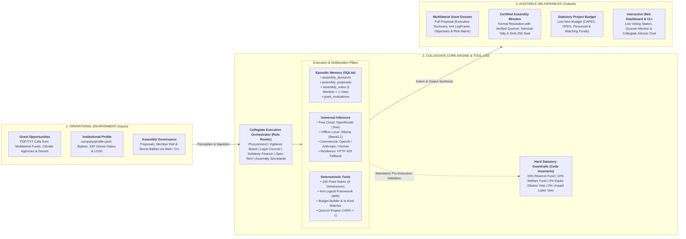

# CoopExecutive Architecture & Autonomous Agent Specification

CoopExecutive is an open-source technical platform designed for cooperatives, civil associations, and social economy organizations.

---

## 1. End-to-End Operational Pipeline

CoopExecutive is structured as an **Autonomous Vertical AI Agent**. The system operates across a 3-stage deterministic pipeline connecting unstructured environmental inputs to verifiable governance and procurement outputs:

---

## 2. Detailed Pipeline Specifications

### Stage 1: Operational Environment & Perception
* **Grant Notices:** Ingests raw text and PDF calls for proposals from international platforms (FundsforNGOs, IDB, Horizon Europe, climate foundations).
* **Institutional Context:** Parses `company/profile.yaml`, accredited legal status (e.g., Authorized Donee under SAT Title III, Cooperative under LGSC), and internal bylaws.
* **Assembly Participation:** Receives member motions and individual secret ballots via the command-line interface or the interactive web station.

### Stage 2: Collegiate Core Engine & Deliberation
1. **Collegiate Orchestrator (`coopexecutive.orchestrator`):**
   - Routes user and system queries to specialized functional hats:
     - `procurador_fondos`: Grant search, rubric qualification, and proposal drafting.
     - `vigilancia`: Internal democratic audit, conflict-of-interest checks, and statutory compliance.
     - `legal_social`: Cooperative law (LGSC), non-profit corporate governance, and open licensing.
     - `finanzas_solidarias`: Cash flow monitoring, budget controls, and statutory reserve preservation.
     - `desarrollo_tecnico`: Open-source tooling, appropriate technology, and standards compliance (ISO/IEC/NOM).
     - `secretaria_asamblea`: Meeting convocations, quorum computation, and certified minutes drafting.

2. **Persistent Episodic Memory (`coopexecutive.memory.episodic`):**
   - SQLite relational database (`coop_memory.db`) storing:
     - `assembly_decisions`: Historical ratified resolutions.
     - `assembly_proposals`: Registered motions for member voting.
     - `assembly_votes`: Individual ballots with a composite primary key / unique constraint `(proposal_id, member_id)` enforcing strictly one vote per member.
     - `grant_evaluations`: Evaluated calls and historical scoring records.

3. **Universal Inference Engine (`coopexecutive.providers.client`):**
   - Unified multi-model routing:
     - *Zero-Cost Cloud:* OpenRouter free tier (`minimax/minimax-m3:free`, `nvidia/nemotron-3-super-120b-a12b:free`).
     - *Offline Local:* Private air-gapped execution via Ollama (`llama3.1`, `qwen2.5`).
     - *Commercial Endpoints:* OpenAI (`gpt-4o`), Anthropic (`claude-3-7-sonnet`), Google Gemini, Groq, Mistral, and DeepSeek.
     - *Rate-Limit Resilience:* Automatic exponential backoff and transparent fallback to secondary models upon receiving HTTP 429 errors.

4. **Deterministic Tool-Use Layer (`coopexecutive.grant_tools`):**
   - Verifiable, non-hallucinatory algorithms:
     - 100-point rubric across 8 dimensions (Eligibility, Relevance, Technical Design, Sustainability, Budget, Risk, Team Capacity, Impact) issuing binding verdicts (`APLICAR`, `OBSERVAR`, `RECHAZAR`).
     - 4x4 Logical Framework Matrix (LFM / MIR) aligning objectives, indicators, means of verification, and assumptions with UN SDGs.
     - Multi-category budget builder with explicit cash and in-kind matching contributions.
     - Digital scrutiny engine computing statutory quorum (>50% + 1 members).

5. **Hard Statutory Guardrails (`coopexecutive.governance.voting`):**
   - Immutable code-level checks preventing the registration or adoption of prohibited terms:
     - Veto against equity dilution, stock issuance, or corporate privatization.
     - Veto against liquidation or diversion of mandatory statutory funds (15% Reserve, 10% Welfare, 10% Education).
     - Veto against mandatory unpaid labor or rights waivers.

### Stage 3: Auditable Deliverables & Effectors
* **Multilateral Proposal Dossier:** Comprehensive, audit-ready Markdown and exportable PDF technical proposals.
* **Cryptographically Sealed Minutes:** Certified scrutiny reports (*Actas de Escrutinio*) stamped with SHA-256 digital hashes for immutable internal audit trails.
* **Structured Budgets:** Detailed financial tables segregating direct costs, administrative caps, and community co-financing.
* **Interactive Local Web Station:** Real-time dashboard (`localhost:8000`) for assembly deliberation, live vote counting, and direct advisor interaction.
