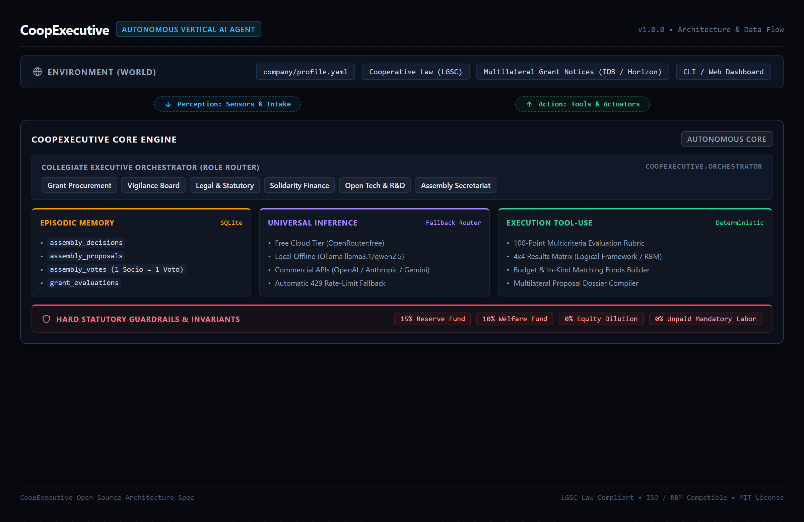
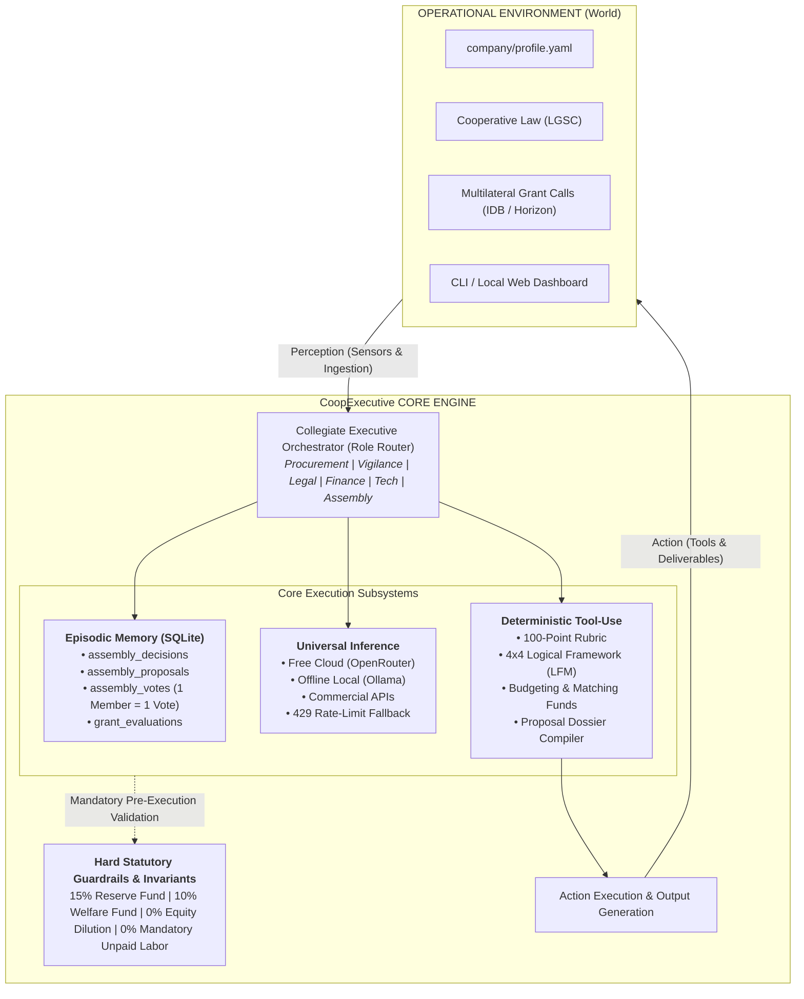

# CoopExecutive Architecture & Autonomous Agent Specification

CoopExecutive is an open-source technical platform designed for cooperatives, civil associations, and social economy organizations.

---

## 1. System Architecture Overview

CoopExecutive is structured as an **Autonomous Vertical AI Agent**. The architecture decouples the operational environment from the core reasoning engine, persistent memory, and deterministic tool execution.

---

## 2. Functional Layers

### Layer 1: Operational Environment & Perception
* **Data Sources:** Reads local configuration files (`company/profile.yaml`), statutory documents, and grant specifications.
* **Perception Channels:** Ingests unstructured documents (PDF and text files) and user directives issued through the CLI or the local web dashboard.

### Layer 2: Collegiate Executive Orchestrator
* Routes tasks dynamically based on functional domain:
  * **`procurador_fondos`:** Evaluates calls and drafts grant proposals.
  * **`vigilancia`:** Verifies that actions comply with internal statutes and prevent conflicts of interest.
  * **`legal_social`:** Ensures compliance with cooperative law and non-profit tax regulations.
  * **`finanzas_solidarias`:** Audits cash flow and enforces the separation of statutory reserves.
  * **`desarrollo_tecnico`:** Assesses hardware specifications and open licensing.
  * **`secretaria_asamblea`:** Manages meeting agendas, roll calls, and official minutes.

### Layer 3: Persistent Episodic Memory (`coopexecutive.memory.episodic`)
* SQLite relational database (`coop_memory.db`) storing:
  * `assembly_decisions`: Formally adopted assembly resolutions.
  * `assembly_proposals`: Motions submitted for member vote.
  * `assembly_votes`: Individual ballots, indexed with unique constraints on `(proposal_id, member_id)` to guarantee one vote per member.
  * `grant_evaluations`: Historical rubric scores and verdicts.

### Layer 4: Universal Inference Engine (`coopexecutive.providers.client`)
* Decoupled client handling multi-provider LLM requests:
  * OpenRouter free tier with automatic retry and model fallback upon HTTP 429.
  * Local Ollama instance for fully offline air-gapped environments.
  * Commercial provider endpoints (OpenAI, Anthropic, Gemini, Groq, DeepSeek) through a unified interface.

### Layer 5: Execution Tool-Use Layer (`coopexecutive.grant_tools`)
* Deterministic modules providing verifiable outputs:
  * **`eligibility_evaluator.py`:** Computes weighted scores across 8 dimensions (0–100 points) and outputs binding status verdicts (`APLICAR`, `OBSERVAR`, `RECHAZAR`).
  * **`logical_framework.py`:** Generates 4x4 Results-Based Management matrices with verifiable indicators and assumptions.
  * **`budget_builder.py`:** Structures expenses by category (Personnel, CAPEX, OPEX, Audit) and calculates matching fund ratios.
  * **`dossier_generator.py`:** Assembles all components into structured markdown/PDF technical dossiers.

### Layer 6: Hard Statutory Guardrails (`coopexecutive.governance.voting`)
* Enforces structural invariants before recording motions or proposals:
  * Invariant 1: Mandatory protection of statutory reserves (Reserve, Welfare, Education funds).
  * Invariant 2: Immediate nullification of any proposal containing clauses for equity dilution or private stock issuance.
  * Invariant 3: Immediate rejection of any motion attempting to enforce mandatory unpaid labor or rights waivers.
