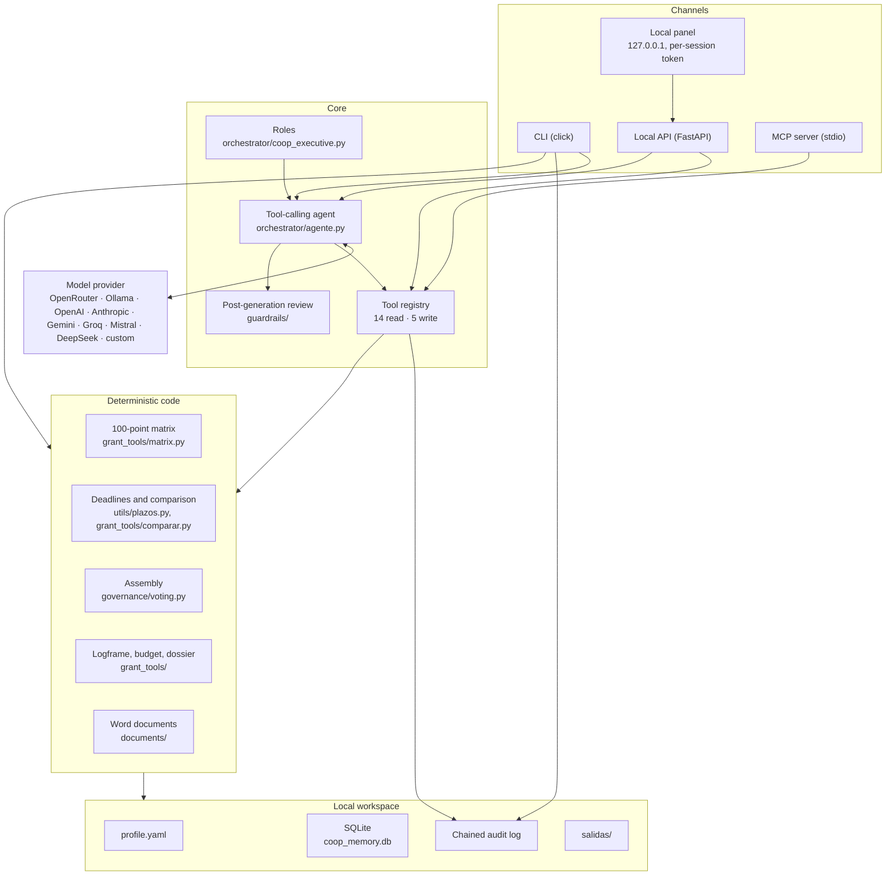

# CoopExecutive architecture

CoopExecutive is a local command-line agent with an optional web panel, local API and MCP server. Everything runs on the user's machine. Decisions that must be reproducible (the evaluation matrix, deadlines, quorum and majority, budgets) are computed in code; the language model drafts text, proposes structured data that code validates, and calls tools.

## Overview

```mermaid
flowchart TB
    subgraph Canales["Channels"]
        CLI["CLI (click)"]
        PANEL["Local panel<br/>127.0.0.1, per-session token"]
        API["Local API (FastAPI)"]
        MCP["MCP server (stdio)"]
    end

    subgraph Nucleo["Core"]
        AGENTE["Tool-calling agent<br/>orchestrator/agente.py"]
        REG["Tool registry<br/>14 read · 5 write"]
        ROLES["Roles<br/>orchestrator/coop_executive.py"]
        REV["Post-generation review<br/>guardrails/"]
    end

    subgraph Determinista["Deterministic code"]
        MATRIZ["100-point matrix<br/>grant_tools/matrix.py"]
        PLAZOS["Deadlines and comparison<br/>utils/plazos.py, grant_tools/comparar.py"]
        ASAMBLEA["Assembly<br/>governance/voting.py"]
        PROY["Logframe, budget, dossier<br/>grant_tools/"]
        DOCS["Word documents<br/>documents/"]
    end

    subgraph Datos["Local workspace"]
        PERFIL["profile.yaml"]
        DB["SQLite<br/>coop_memory.db"]
        BIT["Chained audit log"]
        SAL["salidas/"]
    end

    MODELO["Model provider<br/>OpenRouter · Ollama · OpenAI · Anthropic · Gemini · Groq · Mistral · DeepSeek · custom"]

    CLI --> AGENTE
    PANEL --> API --> REG
    API --> AGENTE
    MCP --> REG
    CLI --> Determinista
    AGENTE <--> MODELO
    AGENTE --> REG
    AGENTE --> REV
    ROLES --> AGENTE
    REG --> Determinista
    Determinista --> Datos
    REG --> BIT
    CLI --> BIT
```

## Channels

| Channel | Entry point | Notes |
|---|---|---|
| CLI | `coopexecutive.cli:cli` | Spanish commands grouped by area. A custom `click.Group` records each command in the audit log. Failures exit with code 1 |
| Local panel | `coopexecutive panel` (alias `dashboard`) | Static files in `web/static/`, no CDN or external fonts. Shows real data or «Sin datos» |
| Local API | `web/app.py:crear_app()` | Listens on 127.0.0.1 only. Bearer token per session, `Host` allow-list, `Origin` check on non-GET requests, strict CSP, `nosniff`, `DENY` framing, `no-store` |
| MCP server | `coopexecutive mcp` (alias `servidor-mcp`), `mcp_server.py` | FastMCP over stdio. Only protocol messages go to stdout; logs go to stderr. `readOnlyHint` reflects whether a tool writes |

The panel, the API, the MCP server and the chat share one tool registry, so a tool behaves the same everywhere.

## Core

### Tool registry (`herramientas/`)

Each tool is a `Herramienta(nombre, descripcion, Entrada, ejecutar, escribe)` with a pydantic input model. Converters produce the OpenAI and Anthropic tool formats.

- **Read (14):** `fecha_y_plazos`, `ver_perfil`, `buscar_conocimiento`, `evaluar_oportunidad` (without saving), `listar_evaluaciones`, `comparar_evaluaciones`, `buscar_financiadores`, `ver_financiador`, `listar_expedientes`, `ver_expediente`, `listar_documentos`, `monitorear_convocatorias`, `ultimo_monitoreo`, `listar_propuestas_asamblea`.
- **Write (5):** `registrar_financiador`, `abrir_expediente`, `registrar_avance`, `guardar_evaluacion`, `generar_documento`.

A write never runs without confirmation: in the CLI a prompt, in the panel a dialog, in the API a 409 `requiere_confirmacion` answer until the call is repeated with `"confirmar": true`. Read-only mode removes the write tools from the catalogue.

### Agent (`orchestrator/agente.py`)

`ejecutar_turno(…, max_pasos=6)` streams the model's answer, collects tool calls (OpenAI `delta.tool_calls` and Anthropic `tool_use` / `input_json_delta`), runs them through the registry and sends the results back. A denied write is reported to the model as not authorised. If the provider rejects tools with a 400, the turn is retried once without them.

### Roles (`orchestrator/coop_executive.py`)

The system prompt combines the base prompt, today's date in the organisation's time zone, the profile and one of seven roles:

| Key | Role |
|---|---|
| `procurador` | Grant procurement |
| `vigilancia` | Oversight board |
| `legal` | Social economy legal counsel |
| `finanzas` | Solidarity finance and statutory funds |
| `tecnico` | Technical sovereignty |
| `comunicacion` | Communication and accountability |
| `asamblea` | Assembly secretariat and minutes |

### Post-generation review (`guardrails/`)

Every drafted text goes through `revisar_respuesta`:

- amounts and dates not present in the context (profile, case, call documents or tool results) are flagged, and in strict mode replaced by `MONTO POR DEFINIR` or `[PENDIENTE: fecha]`;
- CLABE, IBAN and card numbers are always censored;
- claims of actions that no tool executed are flagged;
- recommendations without a counterpoint, emojis and excessive length are flagged.

Source labels (DATO DEL USUARIO, DATO INSTITUCIONAL, DATO PÚBLICO VERIFICADO, SUPUESTO, INFERENCIA ESTRATÉGICA, NO VERIFICADO, PENDIENTE) and markers live in `guardrails/marcadores.py`.

### Model providers (`providers/`)

`AIClient` speaks the OpenAI-compatible chat API and Anthropic's Messages API, emitting `TextoDelta`, `LlamadaHerramienta` and `Fin` events. It validates the key before sending, retries 429, 5xx, connection errors and timeouts with exponential backoff (respecting `Retry-After`), then moves to the fallback model. Errors surface as `ErrorProveedor` with the key censored, never as answer text. With `PROVIDER=auto` the first configured key wins; Ollama uses `LOCAL_MODELS`.

## Deterministic code

| Module | What it computes |
|---|---|
| `grant_tools/matrix.py` | Eight criteria, 100 points. Each score must be an integer within its weight and carry evidence; an empty criterion stays pending. Timeline points must fit the band for the days left. Decision precedence: validation error, excluded or expired, eligibility pending, validity pending, public-position tension, incomplete, then score (80 `APLICAR`, 60 `EXPLORAR`, 40 `CONDICIONAL`, otherwise `DESCARTAR`). A pending tension lowers `APLICAR` and `EXPLORAR` to `CONDICIONAL`. Each result carries a counterpoint, the next step and a SHA-256 hash |
| `utils/plazos.py` | Days left in the organisation's time zone; «(URGENTE)» at 13 days or fewer |
| `grant_tools/comparar.py` | Comparison table and which call to handle first, by deadline or score |
| `governance/voting.py` | Member roll, one vote per member and proposal, quorum of more than half, simple or two-thirds majority from the profile, closed proposals with full SHA-256 hash. Proposals that sell equity, distribute statutory funds or impose unpaid work are rejected |
| `grant_tools/logical_framework.py`, `budget_builder.py`, `dossier_generator.py` | Logframe from YAML; budget where a missing cost is `COSTO POR COTIZAR` and indirect costs only appear with an explicit cap; dossier with statutory funds only for cooperatives |
| `documents/` | Word files built from the profile, case and evaluation with the organisation's letterhead. Missing data becomes `[PENDIENTE: …]`; files are never overwritten |
| `monitoring/` | RSS/Atom feeds from built-in and workspace sources, parsed with `defusedxml`; a closing date is accepted only after a closing keyword |
| `memory/desde_sitio.py` | Profile proposals from the organisation's own website, with sensitive data removed before anything is shown |
| `lectura/` | Reads txt, md, html, docx and pdf, and URLs with byte and content-type limits; blocks private addresses when called from MCP or the API |

## Local data

A workspace (`--espacio` or `COOPEXECUTIVE_WORKSPACE`) holds:

- `profile.yaml`, backed up as `profile.yaml.bak-YYYYMMDD-HHMMSS` before each change, with `procuracion.origenes` recording where each field came from;
- `coop_memory.db` (SQLite, schema versioned with `PRAGMA user_version`, foreign keys on, rollback on error) with the tables `financiadores`, `expedientes`, `avances`, `documentos`, `grant_evaluations`, `monitoreos`, `socios`, `assembly_proposals`, `assembly_votes`, `assembly_decisions` and `bitacora`;
- `salidas/YYYY/EXP-…/` for Word files;
- optional `fuentes.yaml` and `conocimiento/`.

The audit log (`bitacora.py`) stores channel, action, censored parameters, result, `hash_previo` and a SHA-256 `hash` chained to the previous row. `bitacora verificar` detects edited or deleted rows.

## Network traffic

Only these requests leave the machine:

- calls to the model provider the user configured (none with Ollama);
- the organisation's own website, when `configurar --sitio` or `reunion preparar --sitio` is used;
- RSS feeds of funding sources during `monitorear`;
- call documents given as a URL.

## Tests and evals

- `packages/core/tests/`: unit and integration tests with no network; providers are exercised with `httpx.MockTransport` and SSE fixtures.
- `coopexecutive/evals/` (run by `packages/core/evals/test_evals.py`): 22 golden cases covering the matrix, the review and tools with a simulated model. `python -m coopexecutive.evals` prints the summary. See [docs/CASOS_DE_PRUEBA.md](docs/CASOS_DE_PRUEBA.md).
- `tests/test_docs.py` checks that every command cited in the READMEs and guides exists.
