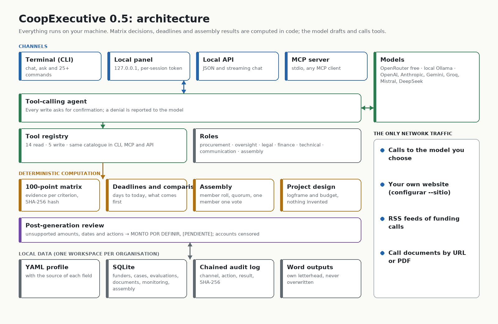
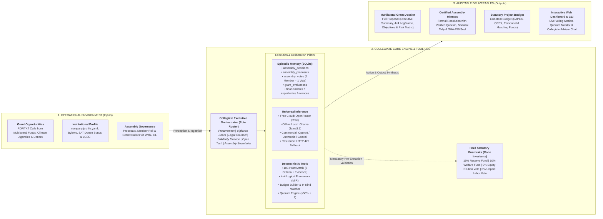

# CoopExecutive Architecture & Autonomous Agent Specification

CoopExecutive is an open-source technical platform designed for cooperatives, civil associations, and social economy organizations.

---

## 1. End-to-End Operational Pipeline

CoopExecutive is structured as an **Autonomous Vertical AI Agent**. The system operates across a 3-stage deterministic pipeline connecting unstructured environmental inputs to verifiable governance and procurement outputs:

```mermaid
flowchart LR
    subgraph STAGE1["1. OPERATIONAL ENVIRONMENT (Inputs)"]
        direction TB
        IN1["<b>Grant Opportunities</b><br/>PDF/TXT Calls from Multilateral Funds, Climate Agencies & Donors"]
        IN2["<b>Institutional Profile</b><br/>company/profile.yaml, Bylaws, SAT Donee Status & LGSC"]
        IN3["<b>Assembly Governance</b><br/>Proposals, Member Roll & Secret Ballots via Web / CLI"]
    end

    STAGE1 -->|"Perception & Ingestion"| ORCH

    subgraph STAGE2["2. COLLEGIATE CORE ENGINE & TOOL-USE"]
        direction TB
        ORCH["<b>Collegiate Executive Orchestrator (Role Router)</b><br/><i>Procurement | Vigilance Board | Legal Counsel | Solidarity Finance | Open Tech | Assembly Secretariat</i>"]
        
        subgraph SUBSYSTEMS["Execution & Deliberation Pillars"]
            direction LR
            MEM["<b>Episodic Memory (SQLite)</b><br/>• assembly_decisions<br/>• assembly_proposals<br/>• assembly_votes (1 Member = 1 Vote)<br/>• grant_evaluations<br/>• financiadores / expedientes / avances"]
            INF["<b>Universal Inference</b><br/>• Free Cloud: OpenRouter (:free)<br/>• Offline Local: Ollama (llama3.1)<br/>• Commercial: OpenAI / Anthropic / Gemini<br/>• Resilience: HTTP 429 Fallback"]
            TOOL["<b>Deterministic Tools</b><br/>• 100-Point Matrix (8 Criteria + Evidence)<br/>• 4x4 Logical Framework (MIR)<br/>• Budget Builder & In-Kind Matcher<br/>• Quorum Engine (>50% + 1)"]
        end

        ORCH --> SUBSYSTEMS
        
        GUARD["<b>Hard Statutory Guardrails (Code Invariants)</b><br/>15% Reserve Fund | 10% Welfare Fund | 0% Equity Dilution Veto | 0% Unpaid Labor Veto"]
        SUBSYSTEMS -.->|"Mandatory Pre-Execution Validation"| GUARD
    end

    SUBSYSTEMS -->|"Action & Output Synthesis"| STAGE3

    subgraph STAGE3["3. AUDITABLE DELIVERABLES (Outputs)"]
        direction TB
        OUT1["<b>Multilateral Grant Dossier</b><br/>Full Proposal (Executive Summary, 4x4 LogFrame, Objectives & Risk Matrix)"]
        OUT2["<b>Certified Assembly Minutes</b><br/>Formal Resolution with Verified Quorum, Nominal Tally & SHA-256 Seal"]
        OUT3["<b>Statutory Project Budget</b><br/>Line-Item Budget (CAPEX, OPEX, Personnel & Matching Funds)"]
        OUT4["<b>Interactive Web Dashboard & CLI</b><br/>Live Voting Station, Quorum Monitor & Collegiate Advisor Chat"]
    end
```

---

## 2. Detailed Pipeline Specifications

### Stage 1: Operational Environment & Perception
* **Grant Notices:** Ingests raw text and PDF calls for proposals from international platforms (FundsforNGOs, IDB, Horizon Europe, climate foundations).
* **Institutional Context:** Parses `company/profile.yaml`, accredited legal status (e.g., Authorized Donee under SAT Title III, Cooperative under LGSC), and internal bylaws.
* **Assembly Participation:** Receives member motions and individual secret ballots via the command-line interface or the interactive web station.

### Stage 2: Collegiate Core Engine & Deliberation
1. **Collegiate Orchestrator (`coopexecutive.orchestrator`):**
   - Routes user and system queries to specialized functional hats:
     - `procurador_fondos`: Grant search, rubric qualification, and proposal drafting.
     - `vigilancia`: Internal democratic audit, conflict-of-interest checks, and statutory compliance.
     - `legal_social`: Cooperative law (LGSC), non-profit corporate governance, and open licensing.
     - `finanzas_solidarias`: Cash flow monitoring, budget controls, and statutory reserve preservation.
     - `desarrollo_tecnico`: Open-source tooling, appropriate technology, and standards compliance (ISO/IEC/NOM).
     - `secretaria_asamblea`: Meeting convocations, quorum computation, and certified minutes drafting.

2. **Persistent Episodic Memory (`coopexecutive.memory.episodic`):**
   - SQLite relational database (`coop_memory.db`) storing:
     - `assembly_decisions`: Historical ratified resolutions.
     - `assembly_proposals`: Registered motions for member voting.
     - `assembly_votes`: Individual ballots with a composite primary key / unique constraint `(proposal_id, member_id)` enforcing strictly one vote per member.
     - `grant_evaluations`: Evaluated calls with the full matrix result, its SHA-256 hash and the linked case.
     - `financiadores`: Funders (`FIN-YYYY-NNNN`) with type, channel, status and amounts in their ISO 4217 currency.
     - `expedientes` and `avances`: Procurement cases (`EXP-YYYY-NNNN`), at most one open per entity and type, with a progress log that records the origin of each fact.
   - The schema is versioned with `PRAGMA user_version`; `initialize_db()` applies pending migrations and is idempotent.
   - **Workspaces (`coopexecutive.config`):** `--espacio` or `COOPEXECUTIVE_WORKSPACE` points to a folder holding `profile.yaml`, `coop_memory.db` and `salidas/`. Explicit `COMPANY_PROFILE_PATH` and `EPISODIC_DB_PATH` still take priority.

3. **Universal Inference Engine (`coopexecutive.providers.client`):**
   - Unified multi-model routing:
     - *Zero-Cost Cloud:* OpenRouter free tier (`minimax/minimax-m3:free`, `nvidia/nemotron-3-super-120b-a12b:free`).
     - *Offline Local:* Private air-gapped execution via Ollama (`llama3.1`, `qwen2.5`).
     - *Commercial Endpoints:* OpenAI (`gpt-4o`), Anthropic (`claude-3-7-sonnet`), Google Gemini, Groq, Mistral, and DeepSeek.
     - *Rate-Limit Resilience:* Automatic exponential backoff and transparent fallback to secondary models upon receiving HTTP 429 errors.

4. **Deterministic Tool-Use Layer (`coopexecutive.grant_tools`):**
   - Verifiable, non-hallucinatory algorithms:
     - 100-point matrix (`grant_tools.matrix`) across 8 criteria: mission alignment (20), geographic and legal eligibility (10), budget range (15), timing (10), technical capacity (15), measurable impact (15), strategic value (10) and reporting requirements (5).
       - Every score must be an integer within its weight and carry evidence; an empty criterion stays pending and never counts as zero.
       - Timing points must match the band for the days left before the deadline, counted in the organisation's time zone.
       - Decision precedence: validation error, excluded eligibility, expired call, unconfirmed eligibility, unconfirmed validity, public-position tension, incomplete evaluation, and finally the score (80 `APLICAR`, 60 `EXPLORAR`, 40 `CONDICIONAL`, otherwise `DESCARTAR`). A pending tension lowers `APLICAR`/`EXPLORAR` to `CONDICIONAL`.
       - Each result includes the next step, a counterpoint and a SHA-256 hash of its inputs and outputs.
     - Funders and cases (`coopexecutive.crm`): folios, catalogues, normalised duplicate detection and progress logs.
     - Post-generation review (`coopexecutive.guardrails`): flags unsupported amounts and dates, emojis, excessive length, missing counterpoints and claimed actions that were not executed.
     - 4x4 Logical Framework Matrix (LFM / MIR) aligning objectives, indicators, means of verification, and assumptions with UN SDGs.
     - Multi-category budget builder with explicit cash and in-kind matching contributions.
     - Digital scrutiny engine computing statutory quorum (>50% + 1 members).

5. **Hard Statutory Guardrails (`coopexecutive.governance.voting`):**
   - Immutable code-level checks preventing the registration or adoption of prohibited terms:
     - Veto against equity dilution, stock issuance, or corporate privatization.
     - Veto against liquidation or diversion of mandatory statutory funds (15% Reserve, 10% Welfare, 10% Education).
     - Veto against mandatory unpaid labor or rights waivers.

### Stage 3: Auditable Deliverables & Effectors
* **Multilateral Proposal Dossier:** Comprehensive, audit-ready Markdown and exportable PDF technical proposals.
* **Cryptographically Sealed Minutes:** Certified scrutiny reports (*Actas de Escrutinio*) stamped with SHA-256 digital hashes for immutable internal audit trails.
* **Structured Budgets:** Detailed financial tables segregating direct costs, administrative caps, and community co-financing.
* **Interactive Local Web Station:** Real-time dashboard (`localhost:8000`) for assembly deliberation, live vote counting, and direct advisor interaction.
