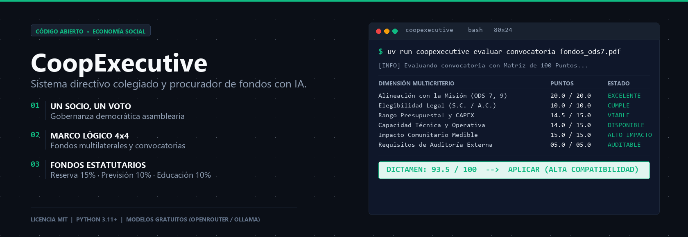
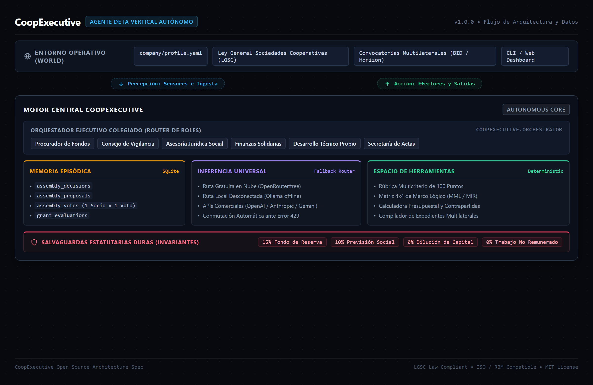
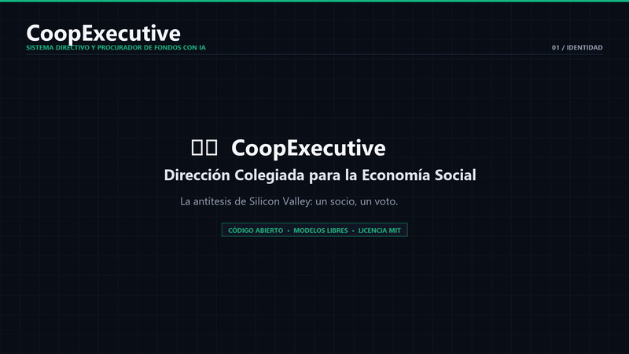

# CoopExecutive



> **Sistema Directivo Colegiado y Agente de Procuración de Fondos para Cooperativas, Asociaciones Civiles (A.C. / ONGs) y Organizaciones de la Economía Social.**

[](LICENSE)
[](https://github.com/pablomorenoc96/coop-executive/actions/workflows/ci.yml)
[](https://www.python.org/)
[](#configuración-de-modelos-de-ia-gratis-locales-y-de-pago)
[](docs/MANIFIESTO_ECONOMIA_SOCIAL.md)

[🇺🇸 Read in English](README.md) | [📢 Kit de Difusión en Redes](docs/KIT_DIFUSION_REDES.md)

**CoopExecutive** es una herramienta de software de código abierto diseñada para organizaciones con toma de decisiones democrática. A diferencia de los sistemas de gestión tradicionales orientados a sociedades anónimas, capital de riesgo y reparto de utilidades privadas, CoopExecutive opera bajo el principio de asambleas soberanas (*un socio, un voto*), salvaguarda de fondos de reserva irrepartibles y postulación a financiamiento no reembolsable.

---

## ¿Qué es técnicamente CoopExecutive?

En términos de arquitectura de software, **CoopExecutive es un Agente de IA Vertical Autónomo**. No es un simple chatbot de conversación libre: es un sistema estructurado en componentes específicos para procesar datos, tomar decisiones operativas bajo reglas legales y generar entregables técnicos auditables.



### Componentes de la Arquitectura

1. **Entorno Operativo y Percepción:**
   - **Entradas:** Ingesta el perfil institucional de la organización (`company/profile.yaml`), bases de convocatorias internacionales de financiamiento y la normativa aplicable (Ley General de Sociedades Cooperativas).
   - **Canales:** Recibe comandos mediante terminal (CLI) y un panel web local interactivo.

2. **Orquestador Colegiado (Router de Roles):**
   - Enruta cada solicitud al rol correspondiente según el área técnica requerida:
     - *Procurador de Fondos:* Evaluación y redacción de propuestas de subvención.
     - *Consejo de Vigilancia:* Auditoría interna y observancia de estatutos.
     - *Asesor Jurídico:* Marco legal cooperativo, donatarias autorizadas y licencias abiertas.
     - *Finanzas Solidarias:* Supervisión del flujo de efectivo y custodia de fondos estatutarios.
     - *Desarrollo Técnico:* Especificación de hardware libre, energías limpias y normas técnicas (ISO/IEC).
     - *Secretaría de Actas:* Convocatorias, registro de asistencia, cuórum legal y minutas.

3. **Memoria Episódica Persistente (SQLite):**
   - Base de datos local (`coop_memory.db`) que almacena y enlaza:
     - Acuerdos de asamblea histórica.
     - Propuestas sometidas a votación.
     - Cédulas de votación emitidas por socio (con garantía técnica de unicidad de voto).
     - Evaluaciones de convocatorias previas.

4. **Inferencia Universal con Conmutación de Proveedores:**
   - Conexión flexible a tres niveles de cómputo:
     - *Nube sin costo ($0.00):* Modelos libres en OpenRouter con conmutación ante errores 429.
     - *Local desconectado:* Ejecución 100% privada con Ollama (`llama3.1`, `qwen2.5`).
     - *APIs comerciales (opcional):* OpenAI, Anthropic, Google Gemini, Groq, Mistral y DeepSeek.

5. **Espacio de Herramientas Deterministas (*Tool-Use*):**
   - Rúbrica multicriterio de 100 puntos (evalúa 8 dimensiones para dictaminar *APLICAR*, *OBSERVAR* o *RECHAZAR*).
   - Matriz de Marco Lógico 4x4 con Objetivos, Indicadores, Medios de Verificación y Supuestos.
   - Generador de presupuestos con cálculo de contrapartidas en efectivo y en especie.
   - Compilador de expedientes técnicos listos para convocatorias internacionales (BID, Horizon, fundaciones).

6. **Salvaguardas Estatutarias Duras (Invariantes):**
   - Reglas inmutables implementadas a nivel de código que bloquean automáticamente cualquier propuesta que intente:
     - Vender acciones, emitir títulos de deuda o diluir la propiedad social.
     - Liquidar o repartir fondos estatutarios protegidos (Fondo de Reserva, Previsión Social, Educación).
     - Imponer trabajo no remunerado obligatorio o cláusulas de renuncia de derechos.

---

## Comparativa Estructural

| Dimensión | Enfoque Corporativo Tradicional | CoopExecutive |
| :--- | :--- | :--- |
| **Poder de Decisión** | Ponderado por capital (*un dólar, un voto*). | Democrático (*un socio, un voto* en Asamblea General). |
| **Supervisión** | Comité de auditoría de accionistas privados. | **Consejo de Vigilancia** electo por la base. |
| **Financiamiento** | Venta de acciones, deuda comercial y absorción. | Fondos operativos propios y **subvenciones no reembolsables**. |
| **Excedentes** | Maximización de dividendos privados. | **Fondos Estatutarios:** Reserva (15%), Previsión Social (10%), Educación (10%). |
| **Régimen Legal** | S.A., S.A.P.I., Delaware C-Corp. | Sociedades Cooperativas (LGSC) y Asociaciones Civiles (A.C.). |
| **Infraestructura** | Software privativo con suscripciones cerradas. | **Código abierto (MIT), modelos libres sin costo y de pago opcionales.** |

---

## Demostración Visual



---

## Capacidades Principales

### 1. Procuración de Fondos y Subvenciones
* **Evaluación de Convocatorias (Rúbrica de 100 Puntos):** Procesa bases en texto o PDF y califica alineación, viabilidad técnica, presupuesto y requisitos legales.
* **Metodología de Marco Lógico (MML):** Genera la Matriz de Indicadores de Resultados (MIR) 4x4 y alinea las actividades a los ODS de la ONU.
* **Expediente Técnico Multilateral:** Compila documentos completos con justificación, presupuesto auditable y plan de monitoreo.

### 2. Votación y Gobernanza Democrática (Un Socio = Un Voto)
* **Emisión de Votos:** Registro individual de socios con validación estricta contra duplicados.
* **Cálculo de Cuórum Legal:** Monitoreo en tiempo real del umbral legal mínimo (50% + 1 socios).
* **Escrutinio Digital:** Emisión de actas oficiales con firma hash SHA-256 para trazabilidad.
* **Filtro de Invariantes Estatutarias:** Rechazo automático de propuestas contrarias a la ley cooperativa.

### 3. Asesoría Directiva Colegiada
* Respuestas técnicas fundamentadas en la LGSC, régimen de Donatarias Autorizadas (SAT) y normas ISO/NOM.
* Consultas operativas sobre fondos de reserva, balances y presupuestos de proyecto.

---

## Inicio Rápido

```bash
git clone https://github.com/pablomorenoc96/coop-executive.git
cd coop-executive/packages/core

# Instalar dependencias con uv:
uv sync --all-groups --extra dev

# Configurar variables de entorno:
cp ../../.env.example .env

# Evaluar una convocatoria con la rúbrica de 100 puntos:
uv run coopexecutive evaluar "Convocatoria_Energia_Limpia_BID.txt"

# Generar un expediente técnico completo para postulación multilateral:
uv run coopexecutive dossier "Microrredes Rurales Comunitarias" --donante "BID"

# Registrar y votar una propuesta en Asamblea General (Un Socio = Un Voto):
uv run coopexecutive propuesta "Postulación al Fondo BID 2026" -d "Aprobación de la contrapartida técnica comunal"
uv run coopexecutive votar 1 --socio-id "SOC-001" --socio-nombre "Elena Gómez" --voto "A_FAVOR"
uv run coopexecutive escrutinio 1 --padron 12

# Abrir el Panel de Control Web interactivo:
uv run coopexecutive dashboard

# Iniciar sesión interactiva con el consejo directivo:
uv run coopexecutive chat
```

---

## Configuración de Modelos de IA (Gratis, Locales y de Pago)

El motor de CoopExecutive soporta tres vías de ejecución configurables en `.env`:
1. **Ruta Gratuita en la Nube ($0.00):** Clave sin costo de [OpenRouter](https://openrouter.ai/keys) para modelos como `minimax/minimax-m3:free` o `nvidia/nemotron-3-super-120b-a12b:free`.
2. **Ruta Local Desconectada (100% Privada y Gratis):** Con [Ollama](https://ollama.com/) local activo, ajusta `LOCAL_MODELS_ENABLED=true` para usar `llama3.1` o `qwen2.5`.
3. **APIs Comerciales (Opcional):** Claves para OpenAI (`gpt-4o`), Anthropic (`claude-3-7-sonnet`), Google Gemini (`gemini-2.0-flash`), Groq, Mistral o DeepSeek.

---

## Documentación Técnica
* [Arquitectura del Sistema y Flujo de Datos](ARCHITECTURE.md)
* [Principios de Economía Social y Gobernanza](docs/MANIFIESTO_ECONOMIA_SOCIAL.md)
* [Guía Práctica de Marco Lógico](docs/GUIA_MARCO_LOGICO.md)
* [Guía de Fondos Estatutarios y Gobernanza LGSC](docs/GUIA_FONDOS_ESTATUTARIOS.md)
* [Guía para Contribuir](CONTRIBUTING.md)
* [Registro de Versiones](CHANGELOG.md)

---

## Licencia
Distribuido bajo licencia [MIT](LICENSE). Código abierto para uso libre y autogestión comunitaria.
