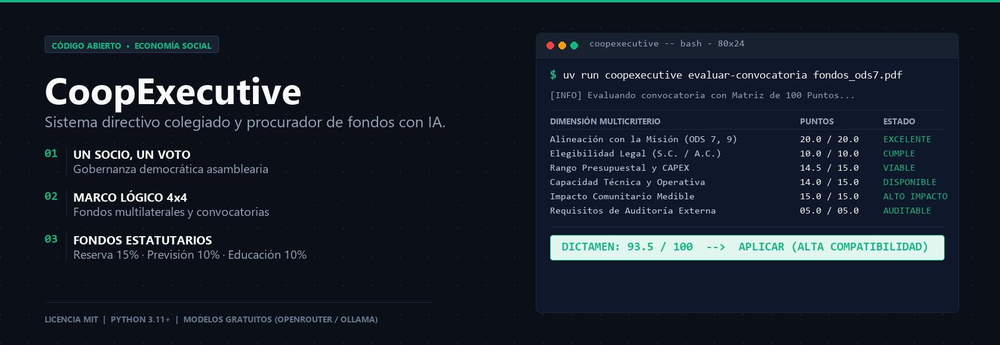
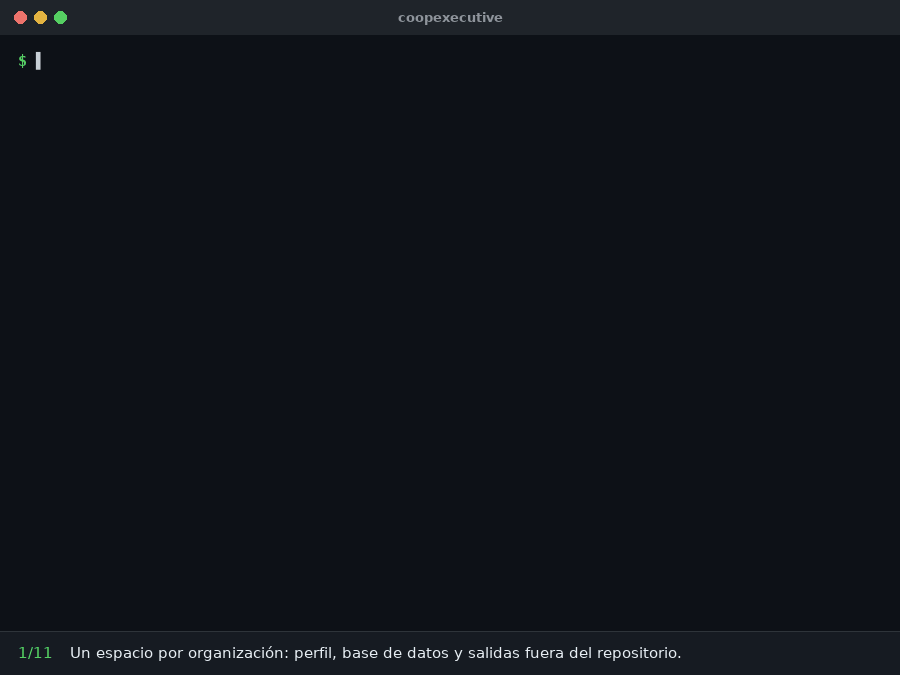
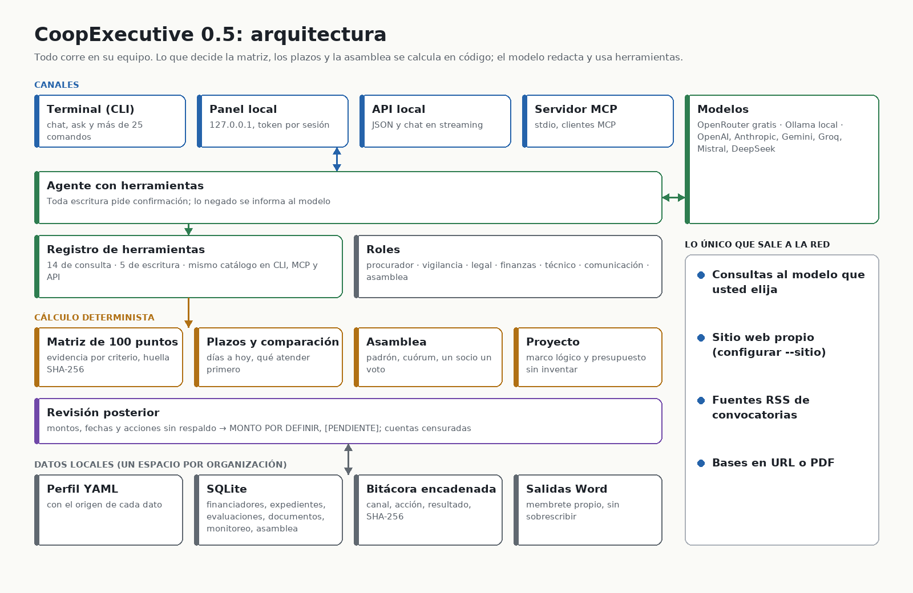

# CoopExecutive



> **Agente procurador de fondos y consejo directivo colegiado para cooperativas, asociaciones civiles y otras organizaciones de la economía social.** Corre en su equipo, funciona con modelos gratuitos o locales y nunca inventa montos, fechas ni alianzas.

[](LICENSE)
[](https://github.com/pablomorenoc96/coop-executive/actions/workflows/ci.yml)
[](https://www.python.org/)
[](#modelos-de-ia-gratis-locales-y-de-pago)
[](#servidor-mcp)

[Read in English](README.md) · [Guía de uso](docs/GUIA_DE_USO.md) · [Casos de prueba](docs/CASOS_DE_PRUEBA.md) · [Arquitectura](ARCHITECTURE.md) · [Registro de versiones](CHANGELOG.md)



*La demostración corre comandos reales en un espacio temporal: crea la organización, carga su perfil, evalúa dos convocatorias, las compara, revisa plazos, genera una ficha en Word y verifica la bitácora. No se simula ninguna respuesta del modelo.*

---

## Qué es

La mayoría de las organizaciones buscan fondos con una hoja de cálculo, una carpeta compartida y la memoria de quien lleva los plazos. Los chatbots genéricos ayudan a redactar, pero rellenan huecos con cifras verosímiles, olvidan lo que se decidió y no dejan registro.

CoopExecutive resuelve en código lo que debe ser exacto y usa el modelo solo donde aporta:

| Forma habitual | CoopExecutive |
|---|---|
| Un puntaje «a ojo» para cada convocatoria | Matriz de 100 puntos con evidencia por criterio, calculada en código y sellada con SHA-256 |
| Los plazos en la agenda de alguien | Días al cierre contados desde hoy en su zona horaria; con 13 días o menos se marca URGENTE |
| Un chatbot que rellena huecos | Montos y fechas sin respaldo se sustituyen por `MONTO POR DEFINIR` y `[PENDIENTE: …]` antes de mostrarse |
| Archivos llamados `final_v3_ok.docx` | Documentos Word con su membrete, ordenados por año y expediente, sin sobrescribir |
| Nadie sabe quién cambió qué | Bitácora encadenada de cada comando y herramienta; `bitacora verificar` detecta ediciones |
| Software de pago que guarda sus datos | Licencia MIT, SQLite y YAML locales, modelos gratuitos en la nube o totalmente locales |
| Votaciones de asamblea en papel | Padrón, cuórum, un socio un voto y actas que dicen qué regla se aplicó |

Atiende a cooperativas, asociaciones civiles, empresas y personas físicas con actividad empresarial. Los fondos estatutarios y la asamblea de un socio, un voto aplican solo a cooperativas.

---

## Qué puede pedirle y qué recibe

### Procuración de fondos

| Área | Pida | Recibe |
|---|---|---|
| Fecha y plazos | `coopexecutive fecha --cierre 2026-10-09` | La fecha de hoy en su zona y los días restantes, con URGENTE a 13 días o menos |
| Evaluar una convocatoria | `coopexecutive evaluar-convocatoria https://ejemplo.org/bases.pdf` | Decisión (APLICAR, EXPLORAR, CONDICIONAL, DESCARTAR o un paso de verificación), puntaje por criterio con evidencia, contrapunto y siguiente paso |
| Comparar convocatorias | `coopexecutive comparar-convocatorias --orden plazo` | Tabla de las evaluaciones guardadas y cuál atender primero |
| Monitorear convocatorias | `coopexecutive monitorear --tema "energía renovable"` | Hasta tres convocatorias abiertas priorizadas, las que hay que revisar y las cerradas, desde canales RSS públicos |
| Financiadores | `coopexecutive financiadores registrar "Fundación Ejemplo" …` | Base de financiadores con folios `FIN-AAAA-NNNN` y detección de duplicados |
| Expedientes | `coopexecutive expedientes abrir "Fundación Ejemplo" --tipo Convocatoria` | Expediente `EXP-AAAA-NNNN` con bitácora de avances y el origen de cada registro |
| Reuniones | `coopexecutive reunion preparar "Fundación Ejemplo" --sitio https://…` | Perfil público (solo de las páginas leídas), puntos en común, riesgos, agenda y preguntas, cada dato con su etiqueta |
| Redacción | `coopexecutive redactar carta-intencion --expediente EXP-2026-0001 --word` | Propuesta, carta de intención, nota conceptual, justificación o correo de seguimiento, revisados antes de mostrarse |
| Documentos Word | `coopexecutive documento ficha --expediente EXP-2026-0001` | Solicitud, documento institucional, ficha, carta, nota conceptual, reporte de monitoreo o de evaluación |
| Diseño de proyecto | `coopexecutive proyecto marco-logico "Microrredes comunitarias" --desde marco.yaml` | Marco lógico, presupuesto con `COSTO POR COTIZAR` y dossier de postulación donde lo faltante queda pendiente |
| Información de la organización | `coopexecutive consultar "¿cuál es nuestra figura jurídica?"` | Pasajes del perfil, de su carpeta `conocimiento/` y de las guías incluidas, con su fuente; «no consta» si nada coincide |
| Sitios y archivos | `coopexecutive revisar https://… --pregunta "¿quién puede postular?"` | Resumen de una página, PDF, Word o HTML que cita su fuente |

### Asamblea y consejo

| Área | Pida | Recibe |
|---|---|---|
| Padrón | `coopexecutive socios alta SOC-001 -n "Socia uno"` | Socios activos, base del cuórum |
| Propuestas y votos | `coopexecutive propuesta …`, `coopexecutive votar 1 -s SOC-001 -v a_favor` | Un voto por socio y propuesta |
| Escrutinio | `coopexecutive escrutinio 1` | Cierra la propuesta, revisa el cuórum, aplica mayoría simple o de dos tercios según el perfil y emite el acta con huella SHA-256 |
| Asesoría del consejo | `coopexecutive chat --rol legal` | Roles: procurador, vigilancia, legal, finanzas, técnico, comunicación y asamblea |

### Plataforma

| Área | Pida | Recibe |
|---|---|---|
| Agente con herramientas | `coopexecutive chat` o `coopexecutive ask "¿qué expedientes vencen este mes?"` | El modelo consulta sus datos con 19 herramientas; las 5 que escriben piden confirmación antes |
| Panel local | `coopexecutive panel` | Tablero en el navegador con datos reales y un chat, servido en 127.0.0.1 |
| API local | `GET /api/expedientes`, `POST /api/chat` | JSON y chat en streaming con las mismas herramientas |
| Servidor MCP | `coopexecutive mcp` | Las mismas herramientas en Claude Desktop, Claude Code o cualquier cliente MCP |
| Bitácora | `coopexecutive bitacora verificar` | Confirma que la cadena está íntegra o señala el primer registro alterado |
| Evaluaciones de comportamiento | `python -m coopexecutive.evals` | 22 casos dorados de la matriz, la revisión y las llamadas a herramientas |

---

## Etiquetas de origen y marcadores

Cada dato importante de una respuesta o documento lleva su origen:

| Etiqueta | Significa |
|---|---|
| `DATO DEL USUARIO` | Usted lo dio |
| `DATO INSTITUCIONAL` | Viene del perfil de la organización |
| `DATO PÚBLICO VERIFICADO` | Se leyó en una fuente pública que se cita |
| `SUPUESTO` | Un supuesto explícito que hay que confirmar |
| `INFERENCIA ESTRATÉGICA` | Razonamiento del agente, no un hecho |
| `NO VERIFICADO` | Se vio, pero no se confirmó |
| `PENDIENTE` | Falta |

Cuando falta un dato, el agente deja un marcador en lugar de inventarlo:

| Marcador | Se usa para |
|---|---|
| `MONTO POR DEFINIR` | Montos sin fuente |
| `COSTO POR COTIZAR` | Partidas de presupuesto sin cotización |
| `[PENDIENTE: dato]` | Cualquier otro dato faltante, como una fecha |
| `VIGENCIA NO VERIFICADA` | Convocatorias cuya fecha de cierre no se pudo confirmar |
| `RESPONSABLE POR CONFIRMAR` | Tareas sin responsable |
| `ESTATUS FISCAL PENDIENTE` | Situación fiscal sin confirmar |
| `MECANISMO DE DONACIÓN PENDIENTE` | Cómo recibe donativos la organización |

Los números de cuenta (CLABE, IBAN, tarjetas) siempre se censuran, en las respuestas y en el perfil.

---

## Instalación

Necesita Python 3.11 o posterior.

**Como usuario, con pipx:**

```bash
pipx install "coopexecutive[web,mcp,pdf] @ git+https://github.com/pablomorenoc96/coop-executive.git#subdirectory=packages/core"
coopexecutive --help
```

**Desde el repositorio, con uv:**

```bash
git clone https://github.com/pablomorenoc96/coop-executive.git
cd coop-executive/packages/core
uv sync --all-extras
uv run coopexecutive --help
```

Extras opcionales: `web` (panel y API), `mcp` (servidor MCP), `pdf` (lectura de PDF), `identidad` (dibujar la intro de la terminal) y `todo` (todos).

---

## Configurar su organización

Cree un espacio por organización, fuera del repositorio. Ahí quedan el perfil, la base de datos y la carpeta `salidas/`:

```bash
coopexecutive iniciar ~/procuracion/mi-org --nombre "Mi Organización" --tipo asociacion_civil
export COOPEXECUTIVE_WORKSPACE=~/procuracion/mi-org   # o use --espacio en cada comando
```

Después complete el perfil de una de dos formas.

**Desde su sitio web.** El agente lee la portada y hasta seis páginas del mismo dominio (nosotros, contacto, programas, únete, transparencia), respeta robots.txt y propone una respuesta a cada pregunta con su evidencia y su URL. Responda «sí» para aceptarla, escriba la corrección o pulse Enter para conservar el valor actual (pendiente si estaba vacío). Antes de proponer nada se quitan cuentas bancarias, RFC, CURP, correos personales y teléfonos.

```bash
coopexecutive configurar --sitio https://www.ejemplo.org/
```

**A mano.** Diez preguntas en la terminal, o un YAML con las respuestas. Si una respuesta es «está en nuestro sitio», el agente pide el enlace una sola vez y lo consulta solo para esa pregunta.

```bash
coopexecutive configurar
coopexecutive configurar --desde company/examples/respuestas_perfil.yaml
```

En ambos casos se respalda el perfil anterior antes de escribir, y el perfil guarda de qué URL salió cada dato.

---

## Recorrido rápido

```bash
# Plazos y evaluación
coopexecutive fecha --cierre 2026-10-09
coopexecutive evaluar-convocatoria --archivo company/examples/convocatoria_ejemplo.yaml
coopexecutive evaluar-convocatoria https://ejemplo.org/bases.pdf --expediente EXP-2026-0001
coopexecutive comparar-convocatorias --orden plazo

# Financiadores, expedientes y documentos
coopexecutive financiadores registrar "Fundación Ejemplo" --proyecto "Microrredes comunitarias" --tipo "Fundación" --canal "Correo" --moneda USD
coopexecutive expedientes abrir "Fundación Ejemplo" --tipo Convocatoria
coopexecutive expedientes avance EXP-2026-0001 --estado "Nota conceptual enviada" --siguiente "Llamar a la oficial de programa"
coopexecutive documento ficha --expediente EXP-2026-0001
coopexecutive redactar nota-conceptual --expediente EXP-2026-0001 --word

# Diseño de proyecto sin cifras inventadas
coopexecutive proyecto marco-logico "Microrredes comunitarias" --plantilla
coopexecutive proyecto presupuesto "Microrredes comunitarias" --desde presupuesto.yaml --tope-indirectos 10
coopexecutive proyecto dossier "Microrredes comunitarias" --expediente EXP-2026-0001

# Asamblea (cooperativas)
coopexecutive socios alta SOC-001 -n "Socia uno"
coopexecutive propuesta "Postular al fondo de energía" -d "Aprobar la postulación y su contrapartida" -c subvencion
coopexecutive votar 1 -s SOC-001 -v a_favor
coopexecutive escrutinio 1

# Agente, panel y bitácora
coopexecutive chat --rol procurador
coopexecutive panel
coopexecutive bitacora verificar
```

La [guía de uso](docs/GUIA_DE_USO.md) recorre cada área con ejemplos completos.

---

## Modelos de IA: gratis, locales y de pago

Copie `.env.example` como `.env` en su carpeta de usuario (`%APPDATA%\CoopExecutive` o `~/.config/coopexecutive`), en la raíz del repositorio o en la carpeta desde la que ejecuta; `coopexecutive info` muestra qué archivos se cargaron. Los nombres se verificaron el 29/09/2026 y cambian seguido: cualquier modelo compatible sirve, y `coopexecutive modelos --herramientas` lista los gratuitos disponibles hoy.

| Vía | Proveedor | Variables | Modelos sugeridos | Privacidad |
|---|---|---|---|---|
| Gratis en la nube | [OpenRouter](https://openrouter.ai/keys) | `OPENROUTER_API_KEY`, `DEFAULT_MODEL` | `google/gemma-4-31b-it:free` (por omisión), `nvidia/nemotron-3-super-120b-a12b:free` (respaldo), `qwen/qwen3.8-27b:free` | Límite diario; los proveedores gratuitos pueden entrenar con sus datos |
| Local y privada | [Ollama](https://ollama.com/) | `LOCAL_MODELS_ENABLED=true`, `LOCAL_MODELS` (el primero es el principal y los demás, respaldos) | `granite4.1:8b`, `granite4.1:3b` (poca memoria), `qwen3.8:27b`, `nemotron3:33b` (GPU de 24 GB) | Nada sale del equipo |
| De pago | OpenAI | `OPENAI_API_KEY` | `gpt-6.1-sol`, `gpt-6-astra`, `gpt-6-luna` | Términos del proveedor |
| De pago | Anthropic | `ANTHROPIC_API_KEY` | `claude-opus-5-5`, `claude-sonnet-5-5`, `claude-haiku-4-5` | Términos del proveedor |
| De pago | Google Gemini | `GEMINI_API_KEY` | `gemini-3.8-flash`, `gemini-3.5-flash-lite` | Términos del proveedor |
| De pago | Groq | `GROQ_API_KEY` | `llama-3.3-70b-versatile`, `openai/gpt-oss-120b` | Términos del proveedor |
| De pago | Mistral | `MISTRAL_API_KEY` | `mistral-medium-3-5-26-04`, `mistral-small-4-0-26-03` | Términos del proveedor |
| De pago | DeepSeek | `DEEPSEEK_API_KEY` | `deepseek-flash`, `deepseek-v4-pro` | Términos del proveedor |
| Cualquiera | Compatible con OpenAI (Azure, vLLM, LiteLLM, LM Studio) | `CUSTOM_BASE_URL`, `CUSTOM_API_KEY` | El que usted aloje | Suya |

Con `PROVIDER=auto` se usa la primera clave presente. Ante límites de uso (429), errores del servidor o caídas de conexión se reintenta hasta `MAX_REINTENTOS` veces con espera creciente antes de pasar al modelo de respaldo. Si un modelo rechaza la definición de herramientas, el turno se repite una vez sin ellas.

Muchos comandos no necesitan modelo: `fecha`, `evaluar-convocatoria --archivo`, `comparar-convocatorias`, `documento`, `consultar`, `financiadores`, `expedientes`, la asamblea y la bitácora.

---

## Panel local y API


```bash
coopexecutive panel               # abre http://127.0.0.1:8765/#token=…
coopexecutive panel --puerto 9000 --no-abrir
```

Pestañas: resumen, perfil, financiadores, expedientes, evaluaciones, documentos, monitoreo, asamblea, bitácora y chat. Una sección vacía lo dice, en lugar de mostrar datos de ejemplo. El panel no carga nada de internet, así que funciona sin conexión.

El mismo servidor ofrece una API JSON bajo `/api/`: `estado`, `perfil`, `financiadores`, `expedientes`, `evaluaciones`, `documentos`, `monitoreo`, `asamblea`, `bitacora` y `herramientas`, además de `POST /api/chat` (eventos enviados por el servidor). Toda petición necesita `Authorization: Bearer <token>`, el token que se imprime al arrancar el panel. Una herramienta que escribe, llamada por `POST /api/herramientas/{nombre}`, responde 409 con un resumen hasta que se repite la llamada con `"confirmar": true`.

---

## Servidor MCP

`coopexecutive mcp` publica las 19 herramientas por stdio. Las que escriben se anuncian sin `readOnlyHint`, de modo que el cliente pide permiso antes de ejecutarlas; `--solo-lectura` las oculta. Ejemplo para Claude Desktop (`claude_desktop_config.json`):

```json
{
  "mcpServers": {
    "coopexecutive": {
      "command": "coopexecutive",
      "args": ["mcp"],
      "env": { "COOPEXECUTIVE_WORKSPACE": "/ruta/a/procuracion/mi-org" }
    }
  }
}
```

Con Claude Code: `claude mcp add coopexecutive -e COOPEXECUTIVE_WORKSPACE=/ruta/a/mi-org -- coopexecutive mcp`.

| De consulta (14) | De escritura (5, piden confirmación) |
|---|---|
| `fecha_y_plazos`, `ver_perfil`, `buscar_conocimiento`, `evaluar_oportunidad`, `listar_evaluaciones`, `comparar_evaluaciones`, `buscar_financiadores`, `ver_financiador`, `listar_expedientes`, `ver_expediente`, `listar_documentos`, `monitorear_convocatorias`, `ultimo_monitoreo`, `listar_propuestas_asamblea` | `registrar_financiador`, `abrir_expediente`, `registrar_avance`, `guardar_evaluacion`, `generar_documento` |

---

## Arquitectura



Los canales (CLI, panel, API y MCP) comparten un solo registro de herramientas. Lo que debe ser exacto se calcula en código: la matriz, los plazos, la comparación, el cuórum y la mayoría, el marco lógico y el presupuesto. El modelo redacta y elige herramientas; después, una revisión comprueba montos, fechas, acciones afirmadas y números de cuenta. Los datos viven en su espacio como YAML, SQLite y archivos Word. El flujo de datos está en [ARCHITECTURE.md](ARCHITECTURE.md).

---

## Seguridad y privacidad

- **Local por omisión.** El perfil, la base de datos, la bitácora y los documentos se quedan en su espacio. El panel y la API solo escuchan en 127.0.0.1, con token por sesión, lista de `Host` permitidos, revisión de `Origin` y una política de seguridad de contenido estricta.
- **Lo que sale de su equipo:** las consultas al modelo que usted elija, su propio sitio cuando corre `configurar --sitio`, los canales RSS públicos al monitorear y las bases que usted da por URL. El monitoreo no envía datos de la organización.
- **Escribir requiere su visto bueno.** En el chat, el panel, la API y MCP, una herramienta que escribe pregunta antes. Si usted la niega, se le informa al modelo y la revisión refleja lo que de verdad se ejecutó.
- **Bitácora a prueba de alteraciones.** Cada comando y herramienta se guarda con una huella SHA-256 encadenada a la anterior. Los parámetros se censuran antes de guardarse.
- **Límites al leer la web.** Las descargas tienen tope de bytes y revisión del tipo de contenido; las peticiones desde MCP o la API no pueden llegar a direcciones de red privadas.
- **Secretos.** Las claves de API se censuran en errores y registros.

## Lo que no hace

- No envía postulaciones ni correos, no firma documentos ni hace pagos en su nombre.
- No garantiza que una convocatoria siga abierta: una fecha de cierre solo se acepta si la fuente la dice; si no, se marca `VIGENCIA NO VERIFICADA`.
- No sustituye la asesoría legal, fiscal ni contable.
- No inventa montos, fechas, alianzas ni resultados. Todo borrador necesita revisión humana antes de salir.

---

## Documentación

- [Guía de uso](docs/GUIA_DE_USO.md) · [User guide](docs/GUIA_DE_USO.en.md)
- [Casos de prueba y resultados esperados](docs/CASOS_DE_PRUEBA.md)
- [Arquitectura y flujo de datos](ARCHITECTURE.md)
- [Guía de marco lógico](docs/GUIA_MARCO_LOGICO.md) · [Guía de fondos estatutarios](docs/GUIA_FONDOS_ESTATUTARIOS.md)
- [Principios de economía social y gobernanza](docs/PRINCIPIOS_ECONOMIA_SOCIAL.md)
- [Cómo contribuir](CONTRIBUTING.md) · [Registro de versiones](CHANGELOG.md)

## Licencia

[MIT](LICENSE). Libre para usar, estudiar, modificar y compartir.
