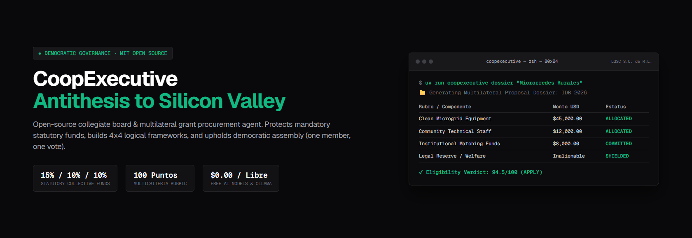
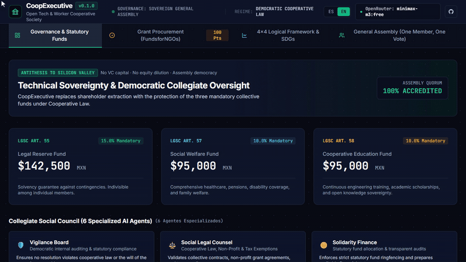

# CoopExecutive



> **Open-Source AI Collegiate Executive Board & Grant Procurement Agent for Cooperatives, Non-Profits (NGOs), and the Social Economy.**

[](LICENSE)
[](https://github.com/pablomorenoc96/coop-executive/actions/workflows/ci.yml)
[](https://www.python.org/)
[](#zero-cost-ai-setup)
[](docs/MANIFIESTO_ECONOMIA_SOCIAL.md)

[🇪🇸 Leer en Español](README.es.md) | [📢 Social Media Outreach Kit](docs/KIT_DIFUSION_REDES.md)

**CoopExecutive** is an open-source alternative to conventional corporate governance software. While traditional Silicon Valley tools assume private venture capital, shareholder primacy, and stock dilution, CoopExecutive is built for **democratic member-led organizations**: sovereign assemblies, collective reserve funds, and social utility.

It includes a dedicated **Grant Procurement Agent** designed to evaluate, plan, and draft multilateral funding proposals for platforms like [FundsforNGOs](https://www.fundsforngos.org/), international development agencies, and environmental foundations.

---

## The Antithesis: Silicon Valley vs. CoopExecutive

| Dimension | Silicon Valley Model | CoopExecutive (Social Economy) |
| :--- | :--- | :--- |
| **Decision Power** | Weighted by capital (*one dollar, one vote*). | Democratic (*one member, one vote* — General Assembly). |
| **Oversight** | Private venture capital investor boards. | Independent internal **Vigilance Board**. |
| **Financing** | Equity dilution, debt, and pressure for an exit. | Sustainable cashflow + **Non-reimbursable grants ([FundsforNGOs](https://www.fundsforngos.org/))**. |
| **Surplus / Profits** | Capital extraction for external shareholders. | **Protected Statutory Funds:** Reserve (15%), Welfare (10%), Education (10%). |
| **Legal Framework** | For-profit corporations (Delaware C-Corp, S.A.). | Cooperative Societies and Non-Profit Civil Associations. |
| **Infrastructure** | Proprietary tools with recurring seat fees. | **100% Open Source, zero-cost AI models ($0.00).** |

---

## Visual Demonstration



---

## Core Capabilities

### 1. Grant Procurement Agent
* **Eligibility Evaluation (100-Point Rubric):** Assesses funding opportunities in seconds across 8 dimensions (*APPLY*, *EXPLORE*, *CONDITIONAL*, or *DO NOT APPLY*).
* **Logical Framework Approach (LFA / MML):** Generates structured 4x4 matrix (Goal, Purpose, Outputs, Activities) with Objectively Verifiable Indicators (OVIs).
* **Theory of Change (ToC):** Connects project inputs and outputs with the UN Sustainable Development Goals (SDGs 7, 8, 9, 12, 13).
* **Auditable Budgets:** Categorizes personnel, equipment (CAPEX), fieldwork (OPEX), and institutional matching funds.

### 2. Collegiate Social Council
* **Vigilance Board:** Democratic internal auditing and statutory compliance.
* **Social Legal Counsel:** Cooperative law, non-profit tax exemptions, and open technology licenses.
* **Solidarity Finance:** Calculation and protection of statutory reserve, welfare, and education funds.
* **Community Technology:** Promotion of open hardware, renewable microgrids, and vocational training.
* **Assembly Secretariat:** Drafting formal meeting notices, quorum checks, and official minutes.

---

## Quickstart

```bash
git clone https://github.com/pablomorenoc96/coop-executive.git
cd coop-executive/packages/core
cp ../../.env.example ../../.env
```

### CLI Commands:
```powershell
# Display active organization profile and statutory funds:
uv run coopexecutive info

# Generate a complete 4x4 Logical Framework matrix:
uv run coopexecutive marco-logico "Community Clean Energy & Technical Training"

# Evaluate any grant opportunity:
uv run coopexecutive evaluar-convocatoria "https://www.fundsforngos.org/..."

# Structure an auditable project budget:
uv run coopexecutive presupuesto "Rural Process Automation Microplant"

# Generate a comprehensive grant proposal dossier:
uv run coopexecutive dossier "Community Clean Energy & Technical Training"

# Open the Interactive Web Dashboard:
uv run coopexecutive dashboard

# Interactive chat session with the collegiate board:
uv run coopexecutive chat
```

---

## AI Model Setup (Free, Local, and Paid Options)

CoopExecutive is a sovereign multi-provider AI engine supporting three flexible execution routes:
1. **Free Cloud Tier ($0.00):** Add a free API key from [OpenRouter](https://openrouter.ai/keys) to `.env` (no credit card required). Access high-performance free models like `minimax/minimax-m3:free` and `nvidia/nemotron-3-super-120b-a12b:free` with automatic 429 rate-limit fallback.
2. **Local Offline Tier (100% Private & Free):** Set `LOCAL_MODELS_ENABLED=true` in `.env` to execute completely offline via [Ollama](https://ollama.com/) with models like `llama3.1` or `qwen2.5`.
3. **Commercial & Paid APIs (Optional):** If your cooperative or non-profit has commercial accounts or institutional credits, you can directly configure API keys for **OpenAI** (`gpt-4o`, `o1`, `o3-mini`), **Anthropic** (`claude-3-7-sonnet`, `claude-3-5-sonnet`), **Google Gemini** (`gemini-2.0-flash`), **Groq**, **Mistral**, **DeepSeek**, or custom OpenAI-compatible enterprise gateways (`vLLM`, `Azure OpenAI`). The engine automatically routes requests based on the selected model and active keys.

---

## Documentation
* [Architecture & Resilience Design](ARCHITECTURE.md)
* [Social Economy Manifesto](docs/MANIFIESTO_ECONOMIA_SOCIAL.md)
* [Logical Framework Practical Guide](docs/GUIA_MARCO_LOGICO.md)
* [Statutory Funds & Cooperative Governance Guide](docs/GUIA_FONDOS_ESTATUTARIOS.md)
* [Contributing Guide](CONTRIBUTING.md)
* [Changelog](CHANGELOG.md)

---

## License
Released under the [MIT License](LICENSE). Free for cooperatives, non-profits, and communities worldwide.
