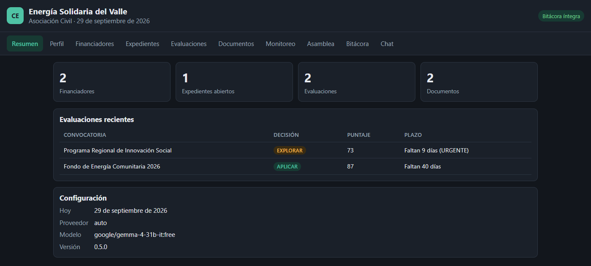

# CoopExecutive


> **Grant procurement agent and collegiate board for cooperatives, civil associations and other social economy organisations.** It runs on your machine, works with free or local models, and never invents amounts, dates or partners.

[](LICENSE)
[](https://github.com/pablomorenoc96/coop-executive/actions/workflows/ci.yml)
[](https://www.python.org/)
[](#ai-models-free-local-and-paid)
[](#mcp-server)

[Leer en español](README.es.md) · [User guide](docs/GUIA_DE_USO.en.md) · [Test cases](docs/CASOS_DE_PRUEBA.md) · [Architecture](ARCHITECTURE.md) · [Changelog](CHANGELOG.md)


*The demo runs real commands in a temporary workspace: create the organisation, load its profile, evaluate two calls, compare them, check deadlines, generate a Word sheet and verify the audit log. No model response is simulated.*

---

## What it is

Most organisations look for funding with a spreadsheet, a shared folder and whoever remembers the deadlines. Generic chatbots help to draft, but they fill gaps with plausible numbers, forget what was decided and leave no record.

CoopExecutive keeps the parts that must be exact in code and uses the model only where it adds value:

| Usual approach | CoopExecutive |
|---|---|
| A score "by feel" for each call | A 100-point matrix with evidence per criterion, computed in code and sealed with SHA-256 |
| Deadlines in someone's calendar | Days to close counted from today in your time zone; 13 days or fewer is flagged URGENT |
| A chatbot that fills gaps | Unsupported amounts and dates are replaced with `MONTO POR DEFINIR` and `[PENDIENTE: …]` before you see them |
| Files named `final_v3_ok.docx` | Word documents with your letterhead, filed by year and case, never overwritten |
| Nobody knows who changed what | A chained audit log of every command and tool call, with `bitacora verificar` to detect edits |
| Paid SaaS that holds your data | MIT licence, local SQLite and YAML, free cloud or fully local models |
| Assembly votes on paper | Member roll, quorum, one member one vote, and minutes that state the rule applied |

It serves cooperatives, civil associations, companies and self-employed people. Statutory funds and the one-member-one-vote assembly apply only to cooperatives. The interface and the documents it produces are in Spanish; the models answer in the language you write in.

---

## What you can ask, what you get

### Grant procurement

| Area | Ask | You get |
|---|---|---|
| Date and deadlines | `coopexecutive fecha --cierre 2026-10-09` | Today's date in your zone and days left, with URGENT at 13 days or fewer |
| Evaluate a call | `coopexecutive evaluar-convocatoria https://example.org/call.pdf` | Decision (APLICAR, EXPLORAR, CONDICIONAL, DESCARTAR or a verification step), score per criterion with evidence, counterpoint and next step |
| Compare calls | `coopexecutive comparar-convocatorias --orden plazo` | A table of saved evaluations and which one to handle first |
| Monitor calls | `coopexecutive monitorear --tema "renewable energy"` | Up to three prioritised open calls, calls to review and closed ones, from public RSS feeds |
| Funders | `coopexecutive financiadores registrar "Example Foundation" …` | A funder base with folios `FIN-YYYY-NNNN` and duplicate detection |
| Cases | `coopexecutive expedientes abrir "Example Foundation" --tipo Convocatoria` | A case `EXP-YYYY-NNNN` with a progress log and the origin of each entry |
| Meetings | `coopexecutive reunion preparar "Example Foundation" --sitio https://…` | Public profile (only from the pages read), common ground, risks, agenda and questions, each item labelled |
| Drafting | `coopexecutive redactar carta-intencion --expediente EXP-2026-0001 --word` | A proposal, letter of intent, concept note, justification or follow-up email, reviewed before display |
| Word documents | `coopexecutive documento ficha --expediente EXP-2026-0001` | Application, institutional document, sheet, letter, concept note, monitoring or evaluation report |
| Project design | `coopexecutive proyecto marco-logico "Community microgrids" --desde marco.yaml` | Logical framework, budget with `COSTO POR COTIZAR`, and an application dossier where anything missing stays pending |
| Organisation info | `coopexecutive consultar "what is our legal status?"` | Passages from the profile, your `conocimiento/` folder and the built-in guides, with their source; "not recorded" if nothing matches |
| Web and files | `coopexecutive revisar https://… --pregunta "who can apply?"` | A summary of a page, PDF, Word or HTML file that cites its source |

### Assembly and board

| Area | Ask | You get |
|---|---|---|
| Member roll | `coopexecutive socios alta SOC-001 -n "Member one"` | Active members, the base for quorum |
| Motions and votes | `coopexecutive propuesta …`, `coopexecutive votar 1 -s SOC-001 -v a_favor` | One ballot per member and motion |
| Count | `coopexecutive escrutinio 1` | Closes the motion, checks quorum, applies simple or two-thirds majority as set in the profile, and issues minutes with a SHA-256 hash |
| Board advice | `coopexecutive chat --rol legal` | Roles: procurement, oversight, legal, finance, technical, communication and assembly |

### Platform

| Area | Ask | You get |
|---|---|---|
| Agent with tools | `coopexecutive chat` or `coopexecutive ask "which cases close this month?"` | The model queries your data with 19 tools; the 5 that write ask for confirmation first |
| Local panel | `coopexecutive panel` | A browser dashboard with real data and a chat, served on 127.0.0.1 |
| Local API | `GET /api/expedientes`, `POST /api/chat` | JSON and streaming chat with the same tools |
| MCP server | `coopexecutive mcp` | The same tools in Claude Desktop, Claude Code or any MCP client |
| Audit log | `coopexecutive bitacora verificar` | Confirms the chain is intact or names the first altered record |
| Behaviour evals | `python -m coopexecutive.evals` | 22 golden cases for the matrix, the review and the tool calls |

---

## Source labels and markers

Every important fact in an answer or document carries its origin:

| Label | Meaning |
|---|---|
| `DATO DEL USUARIO` | You provided it |
| `DATO INSTITUCIONAL` | It comes from the organisation profile |
| `DATO PÚBLICO VERIFICADO` | Read from a public source that is cited |
| `SUPUESTO` | An explicit assumption to confirm |
| `INFERENCIA ESTRATÉGICA` | The agent's reasoning, not a fact |
| `NO VERIFICADO` | Seen but not confirmed |
| `PENDIENTE` | Missing |

When a fact is missing, the agent leaves a marker instead of inventing it:

| Marker | Used for |
|---|---|
| `MONTO POR DEFINIR` | Amounts with no source |
| `COSTO POR COTIZAR` | Budget lines without a quote |
| `[PENDIENTE: dato]` | Any other missing fact, such as a date |
| `VIGENCIA NO VERIFICADA` | Calls whose closing date could not be confirmed |
| `RESPONSABLE POR CONFIRMAR` | Tasks without an owner |
| `ESTATUS FISCAL PENDIENTE` | Tax status not confirmed |
| `MECANISMO DE DONACIÓN PENDIENTE` | How the organisation receives donations |

Bank account numbers (CLABE, IBAN, cards) are always censored, in answers and in the profile.

---

## Installation

You need Python 3.11 or later.

**As a user, with pipx:**

```bash
pipx install "coopexecutive[web,mcp,pdf] @ git+https://github.com/pablomorenoc96/coop-executive.git#subdirectory=packages/core"
coopexecutive --help
```

**From the repository, with uv:**

```bash
git clone https://github.com/pablomorenoc96/coop-executive.git
cd coop-executive/packages/core
uv sync --all-extras
uv run coopexecutive --help
```

Optional extras: `web` (panel and API), `mcp` (MCP server), `pdf` (reading PDFs), `identidad` (drawing the terminal intro) and `todo` (all of them).

---

## Setting up your organisation

Create one workspace per organisation, outside the repository. It holds the profile, the database and the `salidas/` folder:

```bash
coopexecutive iniciar ~/procuracion/my-org --nombre "My Organisation" --tipo asociacion_civil
export COOPEXECUTIVE_WORKSPACE=~/procuracion/my-org   # or pass --espacio on each command
```

Then complete the profile in one of two ways.

**From your website.** The agent reads the home page and up to six pages of the same domain (about, contact, programmes, join, transparency), respects robots.txt and proposes an answer to each question with its evidence and URL. Reply "sí" to accept, type a correction, or press Enter to keep the current value (pending if it was empty). Bank accounts, tax IDs, personal emails and phone numbers are removed before anything is proposed.

```bash
coopexecutive configurar --sitio https://www.example.org/
```

**Manually.** Ten questions in the terminal, or a YAML file with the answers. If an answer is "it's on our website", the agent asks for the link once and reads it only for that question.

```bash
coopexecutive configurar
coopexecutive configurar --desde company/examples/respuestas_perfil.yaml
```

Either way, the previous profile is backed up before writing, and the profile records which URL each fact came from.

---

## Quick tour

```bash
# Deadlines and evaluation
coopexecutive fecha --cierre 2026-10-09
coopexecutive evaluar-convocatoria --archivo company/examples/convocatoria_ejemplo.yaml
coopexecutive evaluar-convocatoria https://example.org/call.pdf --expediente EXP-2026-0001
coopexecutive comparar-convocatorias --orden plazo

# Funders, cases and documents
coopexecutive financiadores registrar "Example Foundation" --proyecto "Community microgrids" --tipo "Fundación" --canal "Correo" --moneda USD
coopexecutive expedientes abrir "Example Foundation" --tipo Convocatoria
coopexecutive expedientes avance EXP-2026-0001 --estado "Concept note sent" --siguiente "Call the programme officer"
coopexecutive documento ficha --expediente EXP-2026-0001
coopexecutive redactar nota-conceptual --expediente EXP-2026-0001 --word

# Project design without invented figures
coopexecutive proyecto marco-logico "Community microgrids" --plantilla
coopexecutive proyecto presupuesto "Community microgrids" --desde presupuesto.yaml --tope-indirectos 10
coopexecutive proyecto dossier "Community microgrids" --expediente EXP-2026-0001

# Assembly (cooperatives)
coopexecutive socios alta SOC-001 -n "Member one"
coopexecutive propuesta "Apply to the energy fund" -d "Approve the application and its matching funds" -c subvencion
coopexecutive votar 1 -s SOC-001 -v a_favor
coopexecutive escrutinio 1

# Agent, panel and audit log
coopexecutive chat --rol procurador
coopexecutive panel
coopexecutive bitacora verificar
```

The [user guide](docs/GUIA_DE_USO.en.md) walks through each area with full examples.

---

## AI models: free, local and paid

Copy `.env.example` to `.env` in your user folder (`%APPDATA%\CoopExecutive` or `~/.config/coopexecutive`), the repository root or the folder you run from; `coopexecutive info` shows which files were loaded. Model names below were checked on 29/09/2026 and change often: any compatible model works, and `coopexecutive modelos --herramientas` lists the free ones available today.

| Tier | Provider | Variables | Suggested models | Privacy |
|---|---|---|---|---|
| Free cloud | [OpenRouter](https://openrouter.ai/keys) | `OPENROUTER_API_KEY`, `DEFAULT_MODEL` | `google/gemma-4-31b-it:free` (default), `nvidia/nemotron-3-super-120b-a12b:free` (fallback), `qwen/qwen3.8-27b:free` | Daily limits; free providers may train on your data |
| Local and private | [Ollama](https://ollama.com/) | `LOCAL_MODELS_ENABLED=true`, `LOCAL_MODELS` (first is primary, the rest fallbacks) | `granite4.1:8b`, `granite4.1:3b` (low memory), `qwen3.8:27b`, `nemotron3:33b` (24 GB GPU) | Nothing leaves your computer |
| Paid | OpenAI | `OPENAI_API_KEY` | `gpt-6.1-sol`, `gpt-6-astra`, `gpt-6-luna` | Provider terms |
| Paid | Anthropic | `ANTHROPIC_API_KEY` | `claude-opus-5-5`, `claude-sonnet-5-5`, `claude-haiku-4-5` | Provider terms |
| Paid | Google Gemini | `GEMINI_API_KEY` | `gemini-3.8-flash`, `gemini-3.5-flash-lite` | Provider terms |
| Paid | Groq | `GROQ_API_KEY` | `llama-3.3-70b-versatile`, `openai/gpt-oss-120b` | Provider terms |
| Paid | Mistral | `MISTRAL_API_KEY` | `mistral-medium-3-5-26-04`, `mistral-small-4-0-26-03` | Provider terms |
| Paid | DeepSeek | `DEEPSEEK_API_KEY` | `deepseek-flash`, `deepseek-v4-pro` | Provider terms |
| Any | OpenAI-compatible (Azure, vLLM, LiteLLM, LM Studio) | `CUSTOM_BASE_URL`, `CUSTOM_API_KEY` | The one you host | Yours |

With `PROVIDER=auto` the first key present is used. Rate limits (429), server errors and dropped connections are retried up to `MAX_REINTENTOS` times with backoff before moving to the fallback model. If a model rejects tool definitions, the turn is retried once without tools.

Many commands need no model at all: `fecha`, `evaluar-convocatoria --archivo`, `comparar-convocatorias`, `documento`, `consultar`, `financiadores`, `expedientes`, the assembly and the audit log.

---

## Local panel and API



```bash
coopexecutive panel               # opens http://127.0.0.1:8765/#token=…
coopexecutive panel --puerto 9000 --no-abrir
```

Tabs: summary, profile, funders, cases, evaluations, documents, monitoring, assembly, audit log and chat. An empty section says so instead of showing sample data. The panel loads nothing from the internet, so it works offline.

The same server exposes a JSON API under `/api/`: `estado`, `perfil`, `financiadores`, `expedientes`, `evaluaciones`, `documentos`, `monitoreo`, `asamblea`, `bitacora` and `herramientas`, plus `POST /api/chat` (server-sent events). Every request needs `Authorization: Bearer <token>`, the token printed when the panel starts. A write tool called through `POST /api/herramientas/{name}` answers 409 with a summary until you repeat the call with `"confirmar": true`.

---

## MCP server

`coopexecutive mcp` publishes the 19 tools over stdio. Write tools are announced without `readOnlyHint`, so the client asks before running them; `--solo-lectura` hides them. Example for Claude Desktop (`claude_desktop_config.json`):

```json
{
  "mcpServers": {
    "coopexecutive": {
      "command": "coopexecutive",
      "args": ["mcp"],
      "env": { "COOPEXECUTIVE_WORKSPACE": "/path/to/procuracion/my-org" }
    }
  }
}
```

With Claude Code: `claude mcp add coopexecutive -e COOPEXECUTIVE_WORKSPACE=/path/to/my-org -- coopexecutive mcp`.

| Read tools (14) | Write tools (5, need confirmation) |
|---|---|
| `fecha_y_plazos`, `ver_perfil`, `buscar_conocimiento`, `evaluar_oportunidad`, `listar_evaluaciones`, `comparar_evaluaciones`, `buscar_financiadores`, `ver_financiador`, `listar_expedientes`, `ver_expediente`, `listar_documentos`, `monitorear_convocatorias`, `ultimo_monitoreo`, `listar_propuestas_asamblea` | `registrar_financiador`, `abrir_expediente`, `registrar_avance`, `guardar_evaluacion`, `generar_documento` |

---

## Architecture


Channels (CLI, panel, API, MCP) share one tool registry. Decisions that must be exact are computed in code: the matrix, deadlines, comparison, quorum and majority, logical framework and budget. The model drafts and chooses tools; a post-generation review then checks amounts, dates, claimed actions and account numbers. Data lives in your workspace as YAML, SQLite and Word files. See [ARCHITECTURE.md](ARCHITECTURE.md) for the data flow.

---

## Security and privacy

- **Local by default.** The profile, the database, the audit log and the documents stay in your workspace. The panel and API listen only on 127.0.0.1, with a per-session token, a Host allow list, an Origin check and a strict content security policy.
- **What leaves your machine:** requests to the model you choose, your own website when you run `configurar --sitio`, public RSS feeds when monitoring, and call documents you give by URL. Monitoring sends no organisation data.
- **Writes need your OK.** In the chat, the panel, the API and MCP, a tool that writes asks first. A denial is reported to the model, and the review reflects what actually ran.
- **Tamper-evident log.** Each command and tool call is stored with a SHA-256 hash chained to the previous one. Parameters are censored before storing.
- **Web reading limits.** Downloads have a byte cap and a content-type check; requests from MCP or the API cannot reach private network addresses.
- **Secrets.** API keys are censored in errors and logs.

## What it does not do

- It does not submit applications, send emails, sign documents or make payments on your behalf.
- It does not guarantee that a call is open: a closing date is only accepted when the source states it, otherwise it is marked `VIGENCIA NO VERIFICADA`.
- It does not replace legal, tax or accounting advice.
- It does not invent amounts, dates, partners or results. Every draft needs human review before it goes out.

---

## Documentation

- [User guide](docs/GUIA_DE_USO.en.md) · [Guía de uso](docs/GUIA_DE_USO.md)
- [Test cases and expected results](docs/CASOS_DE_PRUEBA.md)
- [Architecture and data flow](ARCHITECTURE.md)
- [Logical framework guide](docs/GUIA_MARCO_LOGICO.md) · [Statutory funds guide](docs/GUIA_FONDOS_ESTATUTARIOS.md)
- [Social economy and governance principles](docs/PRINCIPIOS_ECONOMIA_SOCIAL.en.md)
- [Contributing](CONTRIBUTING.md) · [Changelog](CHANGELOG.md)

## License

[MIT](LICENSE). Free to use, study, modify and share.
