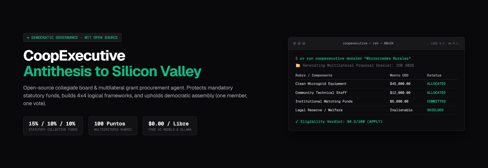
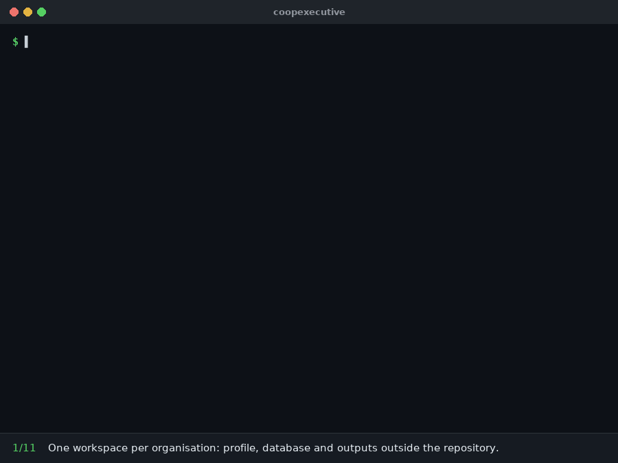

# CoopExecutive



> **Collegiate Executive Board & Grant Procurement AI Agent for Cooperatives, Civil Associations (Non-Profits / NGOs), and Social Economy Organizations.**

[](LICENSE)
[](https://github.com/pablomorenoc96/coop-executive/actions/workflows/ci.yml)
[](https://www.python.org/)
[](#ai-model-setup-free-local-and-paid-options)
[](docs/PRINCIPIOS_ECONOMIA_SOCIAL.en.md)

[🇲🇽 Leer en Español](README.es.md) | [📢 Outreach & Social Media Kit](docs/KIT_DIFUSION_REDES.md)

**CoopExecutive** is an open-source tool built for democratic organizations. Unlike traditional corporate management software focused on shareholder equity, venture rounds, and private profit extraction, CoopExecutive is designed for sovereign assemblies (*one member, one vote*), protected statutory reserves, and non-reimbursable grant funding.

---

## What is CoopExecutive Technically?

In software architecture terms, **CoopExecutive is an Autonomous Vertical AI Agent**. Rather than an open-ended conversational bot, it is a structured system composed of modular layers designed to process environment inputs, apply legal and business rules, and produce auditable technical outputs.


### Architectural Components

1. **Environment & Perception:**
   - **Inputs:** Ingests the institutional profile (`company/profile.yaml`), grant notices from international donors, and applicable legal statutes (Cooperative Law / LGSC).
   - **Channels:** Accepts inputs via command-line interface (CLI) and an interactive local web dashboard.

2. **Collegiate Orchestrator (Role Router):**
   - Routes requests to specialized functional roles:
     - *Grant Procurement:* Opportunity evaluation and proposal drafting.
     - *Vigilance Board:* Internal democratic audit and compliance oversight.
     - *Legal Counsel:* Cooperative statutes, non-profit tax exemptions, and open licensing.
     - *Solidarity Finance:* Cash flow oversight and statutory fund protection.
     - *Open Technology:* Open-source software, accessible technical infrastructure, and industry standards (ISO/IEC/NOM).
     - *Assembly Secretariat:* Agendas, accredited roll, legal quorum, and minutes.

3. **Persistent Episodic Memory (SQLite):**
   - Local database (`coop_memory.db`) maintaining an auditable relational record of:
     - Historical assembly agreements.
     - Assembly proposals.
     - Registered member ballots (with strict deduplication per proposal).
     - Grant opportunity evaluations, with the full result and its SHA-256 hash.
     - Funders, procurement cases and their progress log.

4. **Universal Inference Engine:**
   - Flexible routing across three compute tiers:
     - *Zero-cost cloud tier ($0.00):* Free OpenRouter models with 429 rate-limit fallback.
     - *Local offline tier:* Fully private execution via Ollama (`granite4.1`, `qwen3.8`).
     - *Commercial APIs (optional):* OpenAI, Anthropic, Google Gemini, Groq, Mistral, and DeepSeek.

5. **Deterministic Tool-Use Layer:**
   - Deterministic 100-point matrix: 8 criteria with required evidence, deadline bands and decision precedence (*APLICAR*, *EXPLORAR*, *CONDICIONAL*, *DESCARTAR*, or a verification step when eligibility, validity or evidence is missing).
   - 4x4 Logical Framework Matrix (Goals, Indicators, Verification Means, Assumptions).
   - Budget builder with explicit cash and in-kind matching funds calculations.
   - Multilateral proposal dossier compiler for major funding bodies (IDB, Horizon, foundations).

6. **Hard Statutory Guardrails (Invariants):**
   - Code-level checks that immediately reject any proposal attempting to:
     - Sell equity, issue corporate shares, or dilute member ownership.
     - Liquidate or privatize protected statutory funds (Reserve, Social Welfare, Education).
     - Enforce mandatory unpaid labor or waive fundamental member rights.

---

## Structural Comparison

| Dimension | Traditional Corporate Approach | CoopExecutive |
| :--- | :--- | :--- |
| **Decision Authority** | Capital-weighted (*one dollar, one vote*). | Democratic (*one member, one vote* in General Assembly). |
| **Oversight** | Board of directors representing private shareholders. | Independent **Vigilance Board** elected by members. |
| **Financing** | Equity sales, commercial debt, and acquisition targets. | Sustainable operations and **non-reimbursable grants**. |
| **Surplus** | Maximization of private dividends. | **Protected Statutory Funds:** Reserve (15%), Welfare (10%), Education (10%). |
| **Legal Structure** | For-profit corporations (C-Corp, S.A. de C.V.). | Cooperative Societies and Non-Profit Civil Associations. |
| **Infrastructure** | Proprietary SaaS with subscription lock-in. | **100% Open Source (MIT), free ($0.00) models and optional commercial APIs.** |

---

## Visual Demo



---

## Core Capabilities

### 1. Multilateral Grant Procurement
* **100-Point Evaluation Rubric:** Analyzes text or PDF calls to extract deadlines, budgets, eligibility, and strategic fit.
* **Logical Framework Matrix (LFM / RBM):** Builds 4x4 Results Matrices and connects activities to UN SDGs.
* **Multilateral Proposal Dossier:** Generates audit-ready project documentation for international funding bodies.

### 2. Democratic Assembly Voting (One Member = One Vote)
* **Ballot Casting:** Registers votes individually, rejecting duplicate ballots automatically.
* **Live Quorum Calculation:** Computes whether statutory attendance (>50% + 1 members) has been met.
* **Cryptographic Minutes:** Issues formal certificates with SHA-256 digital hashes for audit trails.
* **Statutory Invariant Verification:** Blocks motions violating cooperative principles or labor rights.

### 3. Collegiate Board Advisory
* Answers operational, technical, and legal questions regarding cooperative law and tax exemption.
* Generates clear documentation for internal assembly review.

### 4. Procurement Workspace (0.2.0)
* **One workspace per organisation:** `iniciar` creates a folder with the profile, the database and an outputs folder. One installation serves several organisations, and their data stays outside the repository.
* **Guided profile setup:** `configurar` asks ten questions (or reads them from a YAML file), shows a summary, and backs up the previous profile before writing. Tax identifiers are rejected.
* **Organisation types:** cooperatives, civil associations, companies and self-employed individuals. Statutory funds and the one-member-one-vote assembly apply only to cooperatives.
* **Deterministic evaluation matrix:** eight criteria with mandatory evidence; an empty criterion stays pending instead of counting as zero. Deadline bands, decision precedence (eligibility, validity, tensions, completeness, score) and a counterpoint are computed in code, and every result is sealed with a SHA-256 hash. The same matrix serves calls, scholarships, awards and loans.
* **Three input modes:** interactive, `--archivo` (YAML) or assisted, where the model only proposes scores with evidence as JSON; pydantic validates the proposal, you confirm it, the matrix decides and the model drafts the analysis.
* **Funders and cases:** a funder base (`FIN-YYYY-NNNN`) with duplicate detection by normalised name and amounts in any ISO 4217 currency, and cases (`EXP-YYYY-NNNN`) with a progress log, data origin and linked evaluations.
* **No invented data:** answers are reviewed after generation. Unsupported amounts and dates are flagged (or replaced with `MONTO POR DEFINIR` / `[PENDIENTE: fecha]` with `--estricto`), as are emojis, answers over 900 words, recommendations without a counterpoint and claims that something was saved when no command ran.

### 5. Documents, Monitoring and Assembly (0.3.0)
* **Word documents:** `documento solicitud`, `documento institucional` and `documento ficha` build an application, an institutional document and an opportunity sheet from the profile, the case and the evaluation. Missing data stays as `[PENDIENTE: …]`. You review the content before it is saved to `salidas/YYYY/EXP-…/`; files are never overwritten and each one is logged in its case.
* **Letterhead per organisation:** header image, footer, font and size come from `procuracion.membrete` in the profile. Default: Arial 11, 1.15 line spacing, 6 pt after, justified text, tables at page width.
* **Opportunity monitoring:** `monitorear` reads public RSS/Atom feeds and returns up to three prioritised notices, notices to review and closed ones. Topics come from the profile's focus areas (or `--tema`), in Spanish or English; a notice is kept only when it contains every significant word of at least one topic. A closing date is only accepted when it follows a closing keyword; otherwise the notice is marked `VIGENCIA NO VERIFICADA`.
* **Your own sources:** add a `fuentes.yaml` to the workspace (see the built-in `knowledge/builtin/procuracion_fondos/fuentes.yaml` for the format: `nombre`, `tipo`, `region`, `idioma`, `url`, `rss`). Optional keys: `temas`, `buscador` (your own SearXNG with JSON enabled) and `solo_propias`. A source without `rss` is listed for manual review.
* **Privacy:** only feed requests leave the machine, plus the topics if a search engine is configured. No profile or funder data is sent. Downloads are cached for 12 hours in `.cache/`, and the cached copy is used if a source is down.
* **Assembly:** `evaluar-convocatoria --proponer-asamblea` turns an APLICAR decision into a `subvencion` proposal that cites the case folio and the evaluation hash. Organisations without an assembly are pointed to their approvers.
* **Terminal intro:** `coopexecutive` shows the organisation's intro, or the built-in one. `intro generar` draws it from the `identidad` block (logo, font, motto, colours) and needs the optional `identidad` extra (`uv sync --extra identidad`). The built-in intro was generated from `assets/isotipo.png` with Arial Bold, 12 logo rows and 6 text rows.

---

## Quickstart

```bash
git clone https://github.com/pablomorenoc96/coop-executive.git
cd coop-executive/packages/core

# Install dependencies with uv:
uv sync --all-groups --extra dev

# Configure environment variables:
cp ../../.env.example .env

# Create a workspace for your organisation (keep it outside the repository):
uv run coopexecutive iniciar ~/procuracion/my-org --nombre "My Organisation" --tipo asociacion_civil
uv run coopexecutive --espacio ~/procuracion/my-org configurar --desde ../../company/examples/respuestas_perfil.yaml

# Evaluate an opportunity with the deterministic 100-point matrix:
uv run coopexecutive --espacio ~/procuracion/my-org evaluar-convocatoria --archivo ../../company/examples/convocatoria_ejemplo.yaml

# Track funders and cases:
uv run coopexecutive --espacio ~/procuracion/my-org financiadores registrar "Example Foundation" --proyecto "Community microgrids" --tipo "Fundación" --canal "Correo" --moneda USD
uv run coopexecutive --espacio ~/procuracion/my-org expedientes abrir "Example Foundation" --tipo Convocatoria

# Monitor open opportunities and generate Word documents for a case:
uv run coopexecutive --espacio ~/procuracion/my-org monitorear
uv run coopexecutive --espacio ~/procuracion/my-org documento ficha --expediente EXP-2026-0001

# Generate a complete multilateral proposal dossier:
uv run coopexecutive dossier "Community Clean Microgrids" --donante "IDB"

# Register and vote on a General Assembly motion (One Member = One Vote):
uv run coopexecutive propuesta "IDB Clean Energy Proposal Approval" -d "Approval of technical matching commitment"
uv run coopexecutive votar 1 --socio-id "SOC-001" --socio-nombre "Elena Gomez" --voto "A_FAVOR"
uv run coopexecutive escrutinio 1 --padron 12

# Open the interactive Web Dashboard:
uv run coopexecutive dashboard

# Start an interactive session with the collegiate board:
uv run coopexecutive chat
```

---

## AI Model Setup (Free, Local, and Paid Options)

Copy `.env.example` to `.env` in your user folder (`%APPDATA%\CoopExecutive` or `~/.config/coopexecutive`), the repository root or the folder you run from; `coopexecutive info` shows which files were loaded. Model names below were checked on 29/09/2026 and change often: any compatible model works, and `coopexecutive modelos --herramientas` lists the free ones available today.

| Tier | Provider | Variables | Suggested models | Privacy |
|---|---|---|---|---|
| Free cloud | [OpenRouter](https://openrouter.ai/keys) | `OPENROUTER_API_KEY`, `DEFAULT_MODEL` | `google/gemma-4-31b-it:free` (default), `nvidia/nemotron-3-super-120b-a12b:free` (fallback), `qwen/qwen3.8-27b:free` | Daily limits; free providers may train on your data |
| Local and private | [Ollama](https://ollama.com/) | `LOCAL_MODELS_ENABLED=true`, `LOCAL_MODELS` (first is primary, the rest fallbacks) | `granite4.1:8b`, `granite4.1:3b` (low memory), `qwen3.8:27b`, `nemotron3:33b` (24 GB GPU) | Nothing leaves your computer |
| Paid | OpenAI | `OPENAI_API_KEY` | `gpt-6.1-sol`, `gpt-6-astra`, `gpt-6-luna` | Provider terms |
| Paid | Anthropic | `ANTHROPIC_API_KEY` | `claude-opus-5-5`, `claude-sonnet-5-5`, `claude-haiku-4-5` | Provider terms |
| Paid | Google Gemini | `GEMINI_API_KEY` | `gemini-3.8-flash`, `gemini-3.5-flash-lite` | Provider terms |
| Paid | Groq | `GROQ_API_KEY` | `llama-3.3-70b-versatile`, `openai/gpt-oss-120b` | Provider terms |
| Paid | Mistral | `MISTRAL_API_KEY` | `mistral-medium-3-5-26-04`, `mistral-small-4-0-26-03` | Provider terms |
| Paid | DeepSeek | `DEEPSEEK_API_KEY` | `deepseek-flash`, `deepseek-v4-pro` | Provider terms |
| Any | OpenAI-compatible (Azure, vLLM, LiteLLM, LM Studio) | `CUSTOM_BASE_URL`, `CUSTOM_API_KEY` | The one you host | Yours |

With `PROVIDER=auto` the first key present is used. Rate limits (429), server errors and dropped connections are retried up to `MAX_REINTENTOS` times with backoff before moving to the fallback model.
---

## Technical Documentation
* [Architecture & Data Flow Specification](ARCHITECTURE.md)
* [Social Economy & Governance Principles](docs/PRINCIPIOS_ECONOMIA_SOCIAL.en.md) | [🇲🇽 Español](docs/PRINCIPIOS_ECONOMIA_SOCIAL.md)
* [Logical Framework Practical Guide](docs/GUIA_MARCO_LOGICO.md)
* [Statutory Funds & Cooperative Governance Guide](docs/GUIA_FONDOS_ESTATUTARIOS.md)
* [Contributing Guide](CONTRIBUTING.md)
* [Changelog](CHANGELOG.md)

---

## License
Distributed under the [MIT](LICENSE) License. Free for open use and community ownership.
